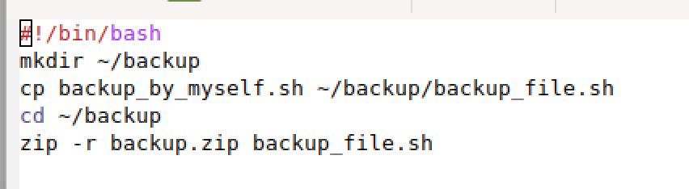
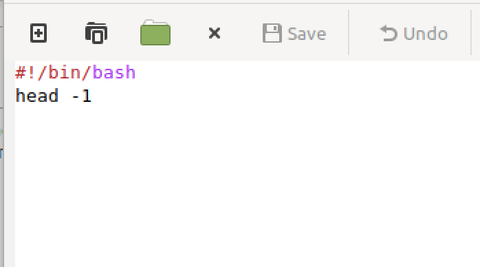
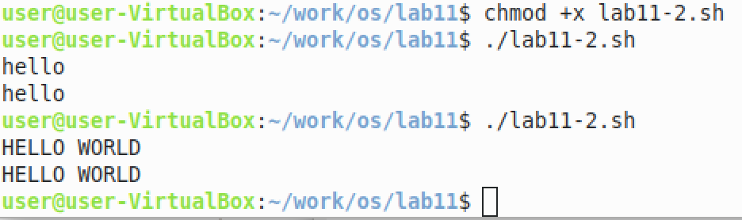
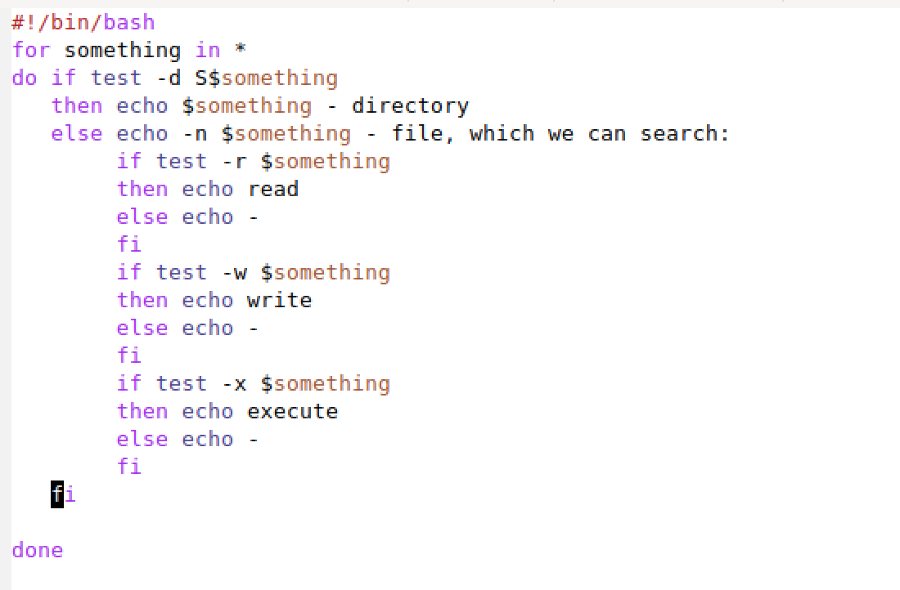
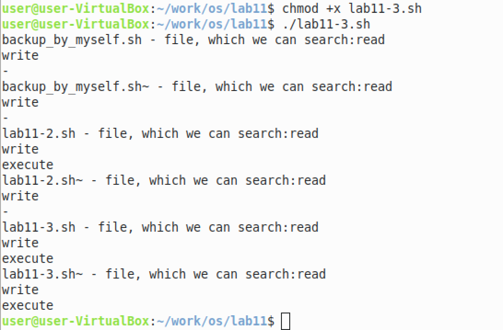
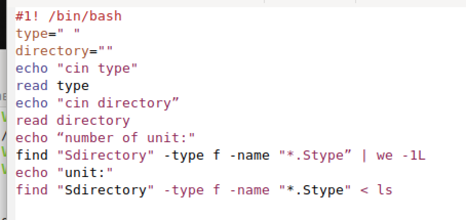
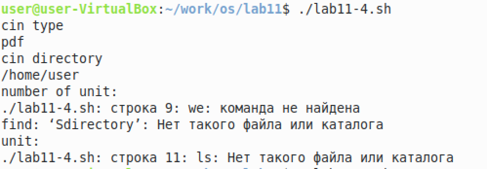
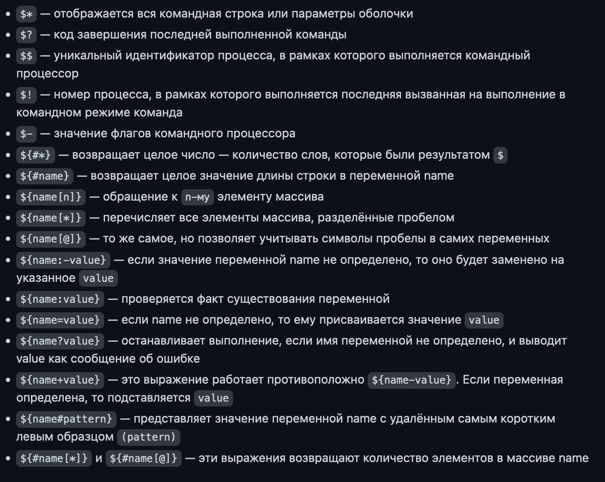

РОССИЙСКИЙ УНИВЕРСИТЕТ ДРУЖБЫ НАРОДОВ

Факультет физико-математических и естественных наук

Кафедра прикладной информатики и теории вероятностей
    

ОТЧЕТ
 

ПО ЛАБОРАТОРНОЙ РАБОТЕ №6
 

дисциплина:Операционные системы
      

Студент: Мартемьянов Александр
 

Группа: НПМбв-02-18
      

МОСКВА
 

2022 г.
 

>**2)Задание**

Изучить основы программирования в оболочке ОС UNIX/Linux. Научиться писать небольшие командные файлы.

>**3) Последовательность выполнения работы**

1. Написать скрипт, который при запуске будет делать резервную копию самого себя (то есть файла, в котором содержится его исходный код) в другую директорию
backup в вашем домашнем каталоге. При этом файл должен архивироваться од-
ним из архиваторов на выбор zip, bzip2 или tar. Способ использования команд
архивации необходимо узнать, изучив справку.

  

Рис 3.  1 «Скрипт для бекапа файла»

  

Рис 3.  2 «Выполение бекапа и просмотр места его созранения»

2. Написать пример командного файла, обрабатывающего любое произвольное
число аргументов командной строки, в том числе превышающее десять. Напри-
мер, скрипт может последовательно распечатывать значения всех переданных
аргументов.

  

Рис 3.  3 «Скрип обрабатывающий значение аргумента»

  

Рис 3.  4 «Скрип обрабатывающий значение аргумента»

3. Написать командный файл — аналог команды ls (без использования самой этой
команды и команды dir). Требуется, чтобы он выдавал информацию о нужном
каталоге и выводил информацию о возможностях доступа к файлам этого каталога.

  

Рис 3.  5 «Вывод информации о каталоге»

  

Рис 3.  6 «Вывод инофрмации о каталоге»

4. Написать командный файл, который получает в качестве аргумента командной
строки формат файла (.txt, .doc, .jpg, .pdf и т.д.) и вычисляет количество
таких файлов в указанной директории. Путь к директории также передаётся в
виде аргумента командной строки.

  

Рис 3.  7 «Вычисление файлов в директории»

  

Рис 3.  8 «Вычисление файлов в директории»

>**4) Выводы согласованные с заданием работы**

В результате выполнения этой работы изучили основы программирования в оболочке ОС UNIX/Linux. Научились писать небольшие командные файлы.

>**5) Ответы на контрольные вопросы**

1. Объясните понятие командной оболочки. Приведите примеры командных оболочек. Чем они отличаются?

Коммандная оболочка - командный интерпретатор, используемый в операционных системах семейства Unix, в котором пользователь может либо давать команды операционной системе по отдельности, либо запускать скрипты, состоящие из списка команд.

Примеры коммандных оболочек:

Bash — самая распространённая оболочка под Linux. ...
pdksh — клон korn shell, хорошо известной оболочки в системах UNIX;
tcsh — улучшенная версия >C shell;
zsh — новейшая из перечисленных здесь оболочек; реализует улучшенное дополнение и другие удобные функции.

2. Что такое POSIX?

POSIX - стандартизированный интерфейс оболочки между пользователем и операционной системой. В теории, абсолютно все дистрибутивы выполненные на основе *nix, обладают возможностью кроссплатформенного исполнения инструкций, например инструкция для Ubuntu, MacOS, Solaris должна выглядеть одинаково при использовании гайдлайнов POSIX, отдельно все встраиваемые операционные системы обладают стандартом POSIX Ready, что означает почти 99% (кроме специальных инструкций, например из-за различных архитектур ОС) поддерживаемость и на других дистрибутивах с такой пометкой

3. Как определяются переменные и массивы в языке программирования bash?

В bash могут быть определены одномерные массивы - переменные специального вида, доступ к которым осуществляется с одним именем, но с разным индексом. Для управления используются команды: name[%n%] = value

4. Каково назначение операторов let и read?

Оператор let - используется для суммирования Оператор read - считывает строку из стандартного ввода и разбивает на слова

5. Какие арифметические операции можно применять в языке программирования
bash?

Арифметические операции в bash:

+ - сложение
- - вычитание
* - умножение
/ - деление
% - вычисление остатка
** - возведение в степень
+= - декремент
-= - инкремент
*= - умножение на заданное число
/= - деление на заданное число

6. Что означает операция (( ))?

(( )) - запись условия if-else в оболочке bash

7. Какие стандартные имена переменных Вам известны?

Стандартные переменные:

HOME - домашний каталог пользователя
CDPATH - список каталогов разделенных двоеточиями и используемые при поиске пути встроенной командой cd
IFS - символы, с помощью которых разделяются поля
MAIL - если не задан MAILPATH, то пользователь будет информирован
MAILPATH - список имен файлов, которые ОС периодически проверяет на наличие письма
PATH - список каталогов, в которых командная оболочка ищет команды

8. Что такое метасимволы?

' < > * ? | \ " & - метасимволы, которые значительно упрощают использование командной оболочки путем написания регулярных выражений

9. Как экранировать метасимволы?

Экранирование осуществляется с помощью обратного слеша \, для выражений используются двойные кавычки, а для экранирования группы метасимволов испольщуют одинарные кавычки

10. Как создавать и запускать командные файлы?

Создаем текстовый файл с необходмой кодировкой, открываем терминал, переходим в директорию с файлов, и исполняем команду: bash my_command [arguments], вводим необходимые аргументы после названия нашего файла и нажимаем Enter, так же можно изменить доступ и дать права sudo chmod u+x my_command и после изменения доступа можно вызывать коммандный файл без использования слова bash

11. Как определяются функции в языке программирования bash?

Для создания функций используется ключевое слово function, после которого можно написать команды которые при исполнении файла будут исполнены в одном блоке function

12. Каким образом можно выяснить, является файл каталогом или обычным файлом?

Заходим в терминал, пишем ls -lrt, смотрим вывод, если в выводе есть символ d, то значит что искомый нами файл является директорийй (каталогом или папкой)

13. Каково назначение команд set, typeset и unset?

Команда set - выводит список переменных окружений Команда typeset - ограничивает переменные (изменяет доступ, числа, массив или вообще осущесвляет экспорт данных) Команда unset - удаляет переменную, а на самом деле устанавливает ее значение null

14. Как передаются параметры в командные файлы?

В командный файл можно передать от одного до девяти файлов

15. Назовите специальные переменные языка bash и их назначение.

  

