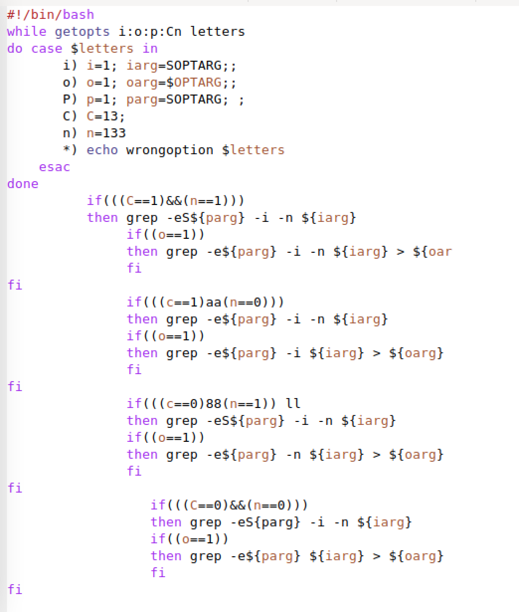
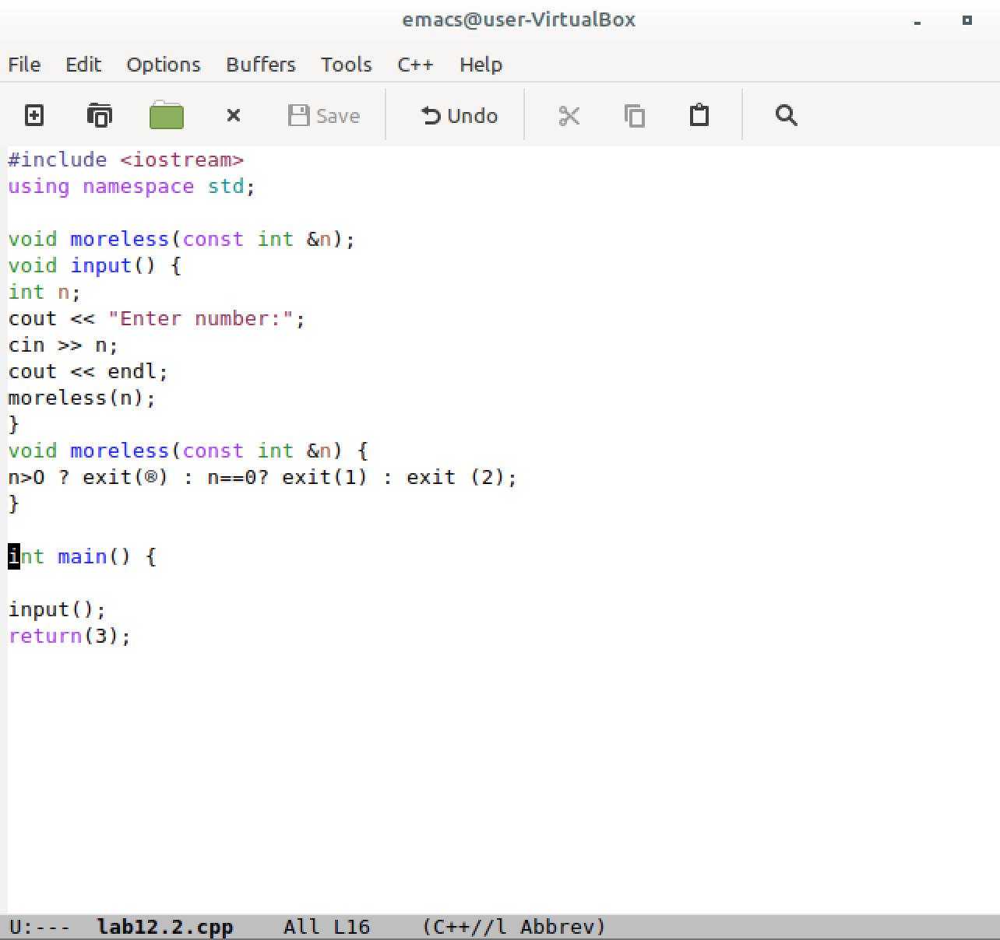
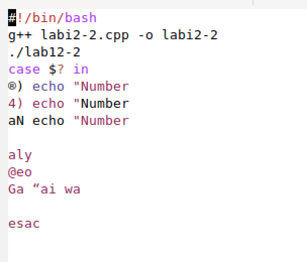
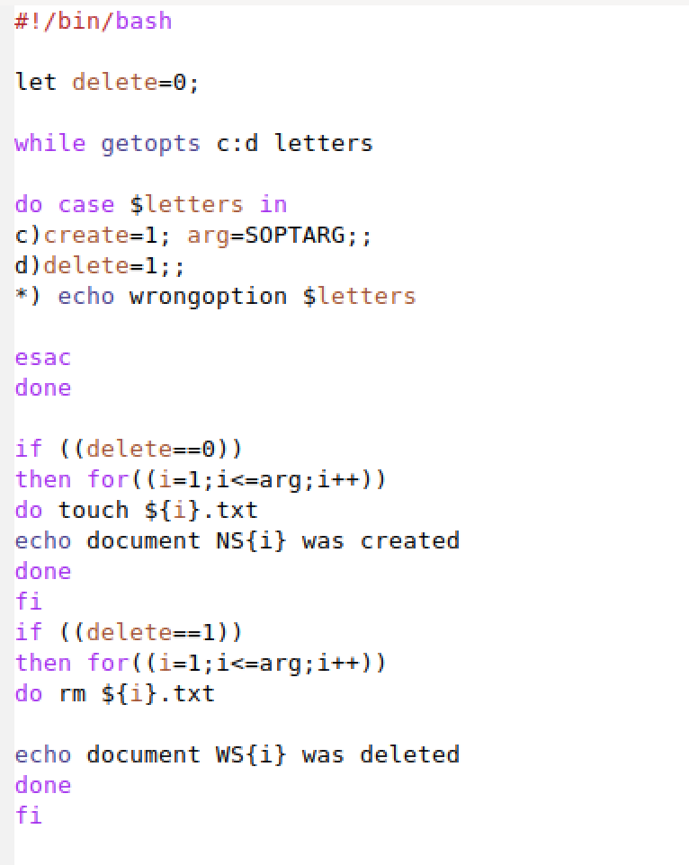
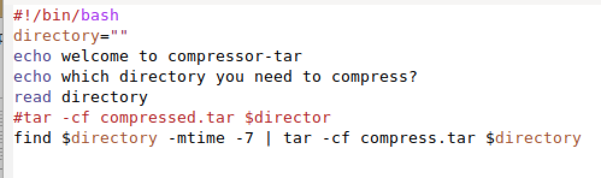
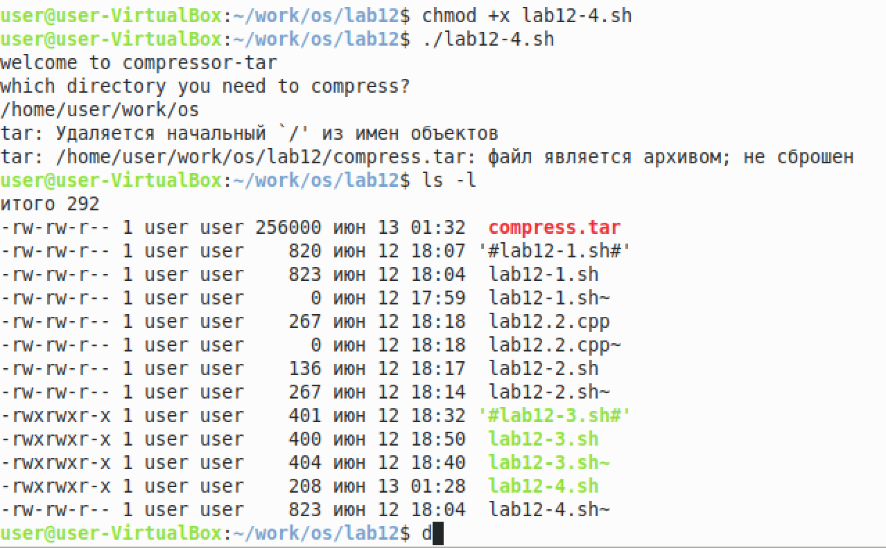

РОССИЙСКИЙ УНИВЕРСИТЕТ ДРУЖБЫ НАРОДОВ

Факультет физико-математических и естественных наук

Кафедра прикладной информатики и теории вероятностей
    

ОТЧЕТ
 

ПО ЛАБОРАТОРНОЙ РАБОТЕ №6
 

дисциплина:Операционные системы
      

Студент: Мартемьянов Александр
 

Группа: НПМбв-02-18
      

МОСКВА
 

2022 г.
 

>**2)Задание**

Изучить основы программирования в оболочке ОС UNIX. Научится писать бо-
лее сложные командные файлы с использованием логических управляющих кон-
струкций и циклов.

>**3) Последовательность выполнения работы**

1. Используя команды getopts grep, написать командный файл, который анали-
зирует командную строку с ключами:
– -iinputfile — прочитать данные из указанного файла;
– -ooutputfile — вывести данные в указанный файл;
– -pшаблон — указать шаблон для поиска;
– -C — различать большие и малые буквы;
– -n — выдавать номера строк.
а затем ищет в указанном файле нужные строки, определяемые ключом -p.

  

Рис 3.  1 «Анализ коммандной строки»

2. Написать на языке Си программу, которая вводит число и определяет, является
ли оно больше нуля, меньше нуля или равно нулю. Затем программа завершается
с помощью функции exit(n), передавая информацию в о коде завершения в
оболочку. Командный файл должен вызывать эту программу и, проанализировав
с помощью команды $?, выдать сообщение о том, какое число было введено.

  

Рис 3.  2 «Сравненеи чисел»

  

Рис 3.  3 «Сравненеи чисел»

3. Написать командный файл, создающий указанное число файлов, пронумерован-
ных последовательно от 1 до N (например 1.tmp, 2.tmp, 3.tmp,4.tmp и т.д.).
Число файлов, которые необходимо создать, передаётся в аргументы командной
строки. Этот же командный файл должен уметь удалять все созданные им файлы
(если они существуют).

  

Рис 3.  4 «Создание указанное число файлов»

  

Рис 3.  5 «Создание указанное число файлов»

4. Написать командный файл, который с помощью команды tar запаковывает в
архив все файлы в указанной директории. Модифицировать его так, чтобы запа-
ковывались только те файлы, которые были изменены менее недели тому назад
(использовать команду find).

  

Рис 3.  6 «Упаковка файлов в архив»

  

Рис 3.  7 «Упаковка файлов в архив»

>**4) Выводы согласованные с заданием работы**

В результате выполнения этой работы изучили основы программирования в оболочке ОС UNIX. Научились писать более сложные командные файлы с использованием логических управляющих конструкций и циклов.
>**5) Ответы на контрольные вопросы**

1. Каково предназначение команды getopts?

getpods - эта утилита анализирует аргументы команд из исполняемого файла

2. Какое отношение метасимволы имеют к генерации имён файлов?

    Следующие метасимволы используют для генерации имен файлов:

        * - любая или пустая последовательность символов

        ? - один любой символ
        [...] - любой из символов указанных в квадратных скобках с перечислением или указанием диапазона
        cat N* - выдает все файлы начинающиеся с N
        cat *N* - выдает все файлы содержащие N
        cat - выдаст все файлы с однобуквенным расширением hello.o, hello.c, но не hello.cpp
        program.? - выдаст program.com
        cat [a-d]* - выдаст файлы которые начинаются с буквы a и заканчиваются d

3. Какие операторы управления действиями вы знаете?

Операторы управления действиями - > (вывод информации), < (ввод информации), & (управляет потоком исполнения команд), && (запускает исполнения команды или команд в фоне), | (передает данные между программами), || (проверяет код завершения предыдущей команды)

4. Какие операторы используются для прерывания цикла?

Команда break служит для прерывания цикла и передает управление программой команде, которая идет следующей за циклом

5. Для чего нужны команды false и true?

alse - логическое нет, отрицание, то есть дальнейшую остановку программы или переход в другую ветвь ветвления программы в зависимости от условий
true - логическое да, согласие на дальнейшее исполнение программы согласно заданным условия

6. Что означает строка if test -f man$s/$i.$s, встреченная в командном файле?

Строка if test -f man$s/$i.$s означает условие для проверки существования файла man

7. Объясните различия между конструкциями while и until

while - выполняет цикл пока указанное в нем условие истинно (1, true), а until - выполняет цикл пока указанное в нем условие ложно (0, false)