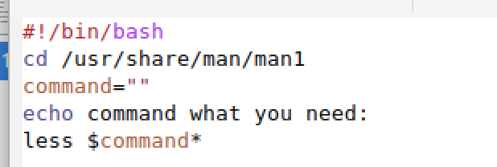
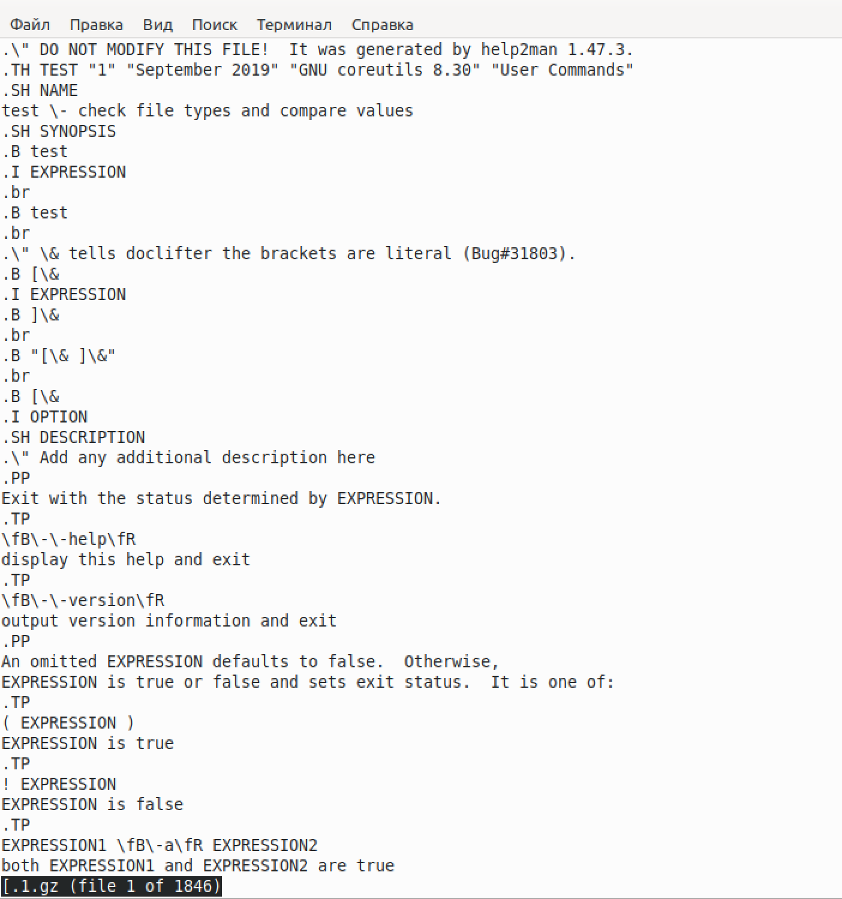
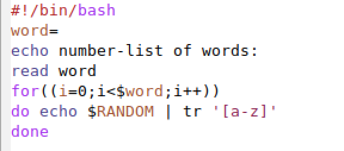
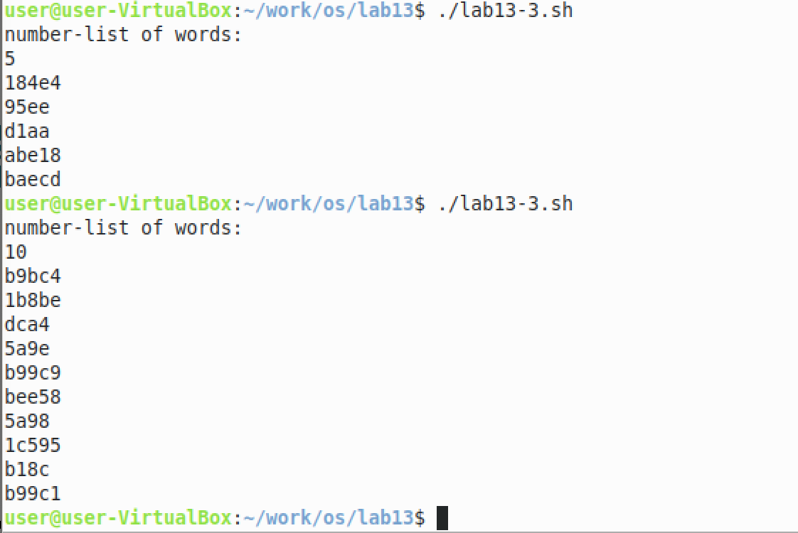

РОССИЙСКИЙ УНИВЕРСИТЕТ ДРУЖБЫ НАРОДОВ

Факультет физико-математических и естественных наук

Кафедра прикладной информатики и теории вероятностей
    

ОТЧЕТ
 

ПО ЛАБОРАТОРНОЙ РАБОТЕ №6
 

дисциплина:Операционные системы
      

Студент: Мартемьянов Александр
 

Группа: НПМбв-02-18
      

МОСКВА
 

2022 г.
 

>**2)Задание**

Изучить основы программирования в оболочке ОС UNIX. Научиться писать более сложные командные файлы с использованием логических управляющих конструкций и циклов.

>**3) Последовательность выполнения работы**

1. Написать командный файл, реализующий упрощённый механизм семафоров. Командный файл должен в течение некоторого времени t1 дожидаться освобождения ресурса, выдавая об этом сообщение, а дождавшись его освобождения, использовать его в течение некоторого времени t2<>t1, также выдавая информацию о том, что ресурс используется соответствующим командным файлом (процессом). Запустить командный файл в одном виртуальном терминале в фоновом режиме, перенаправив его вывод в другой > /dev/tty#, где#— номер терминала куда перенаправляется вывод, в котором также запущен этот файл, но не в фоновом, а в привилегированном режиме. Доработать программу так, чтобы имелась возможность взаимодействия трёх и более процессов

2. Реализовать команду man с помощью командного файла. Изучите содержимое каталога /usr/share/man/man1. В нем находятся архивы текстовых файлов, содержащих справку по большинству установленных в системе программ и команд. Каждый архив можно открыть командой less сразу же просмотрев содержимое справки. Командный файл должен получать в виде аргумента командной строки название команды и в виде результата выдавать справку об этой команде или сообщение об отсутствии справки, если соответствующего файла нет в каталоге man1

  

Рис 3.  3 «Реализация команды man с помощью командного файла»

  

Рис 3.  4 «Реализация команды man с помощью командного файла»

3. Используя встроенную переменную $RANDOM, напишите командный файл, генерирующий случайную последовательность букв латинского алфавита. Учтите,что $RANDOM выдаёт псевдослучайные числа в диапазоне от 0 до 32767.

  

Рис 3.  5 «Генерация случайного числа»

  

Рис 3.  6 «Генерация случайного числа»

>**4) Выводы согласованные с заданием работы**

В результате выполнения этой работы изучили основы программирования в оболочке ОС UNIX. Научились писать более сложные командные файлы с использованием логических управляющих конструкций и циклов

>**5) Ответы на контрольные вопросы**

1. Найдите синтаксическую ошибку в следующей строке: while [$1 != "exit"]

Для правильного исполнения командной строки while [$1 != "exit"] квадратные скобки нужно поменять на круглые скобки

2. Как объединить (конкатенация) несколько строк в одну?

Использовать знак $ между двумя переменными символьного типа для оъединения нескольких строк в одно единую целую строку

3. Найдите информацию об утилите seq. Какими иными способами можно реализовать её функционал при программировании на bash?

seq - выводит последовательность целых или действительных чисел для передачи в другие программы, на языке bash её можно реализовать с помощью цикла for

4. Какой результат даст вычисление выражения $((10/3))?

10 / 3 = 3 (дробная часть будет отброшена, так как числа целые, но если бы было 10.000/3.000 = 3.333)

5. Укажите кратко основные отличия командной оболочки zsh от bash.

Zsh выполнен на основе bash, а поэтому наследует как недостатки так и преимущества bash, но в zsh есть автодополнение, горячие клавишы, алиасы, различные удобства в виде тем, плагинов и расширенной поддержке, однако есть минус всей этой красоты и удобства, на узкоспециализированных машинах это красоты быть не может в принципе из-за ограничений железа или системного администратора

6. Проверьте, верен ли синтаксис данной конструкции
for ((a=1; a <= LIMIT; a++))

Синтаксис верен, однако для надежности лучше писать for и ((some words)) без пробела, т.е. слитно

7. Сравните язык bash с какими-либо языками программирования. Какие преимущества у bash по сравнению с ними? Какие недостатки?

Плюсы Python - является мощным ООП-языком программирования, проблем при написании кода будет менньше, имеет  автозаполнение, улучшенного синтаксиса, кроссплатформенности, подходит для автоматизированния процессов разработки ПО

Минусы Python - скорость,недостаток в скорости ограничивает область применения этого языка в задачах

Плюсы Bash - является низкоуровненвым языком программирования, что позволяет писать скрипты приближенные к синтаксису C-language, подходит больше для системного администрирования

Минусы Bash - не является кроссплатформенным языком для написания скриптов