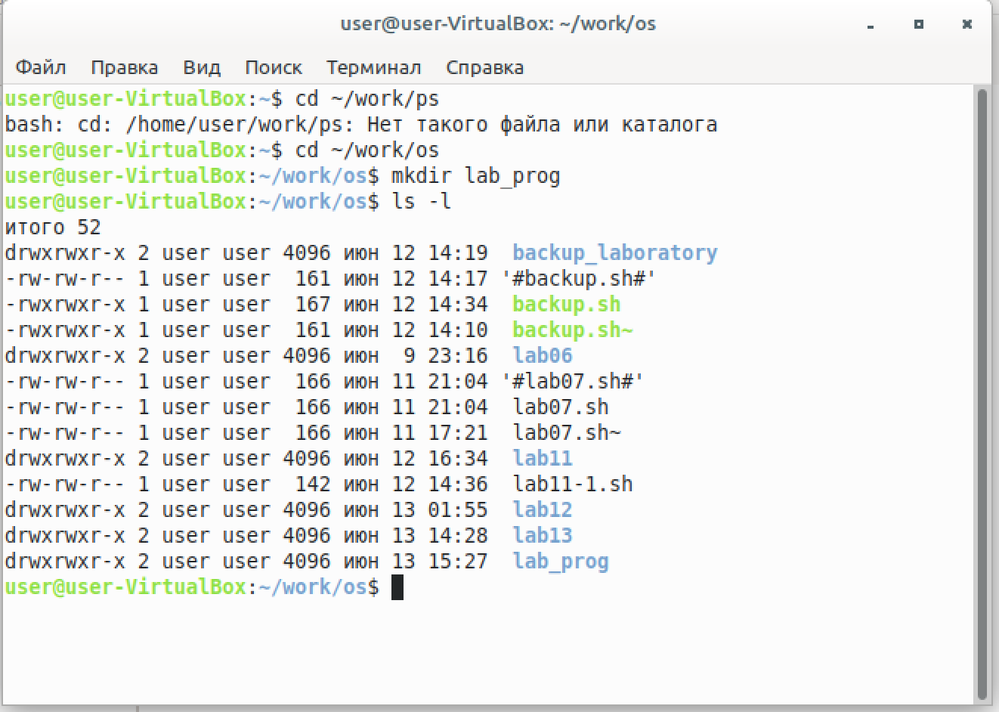
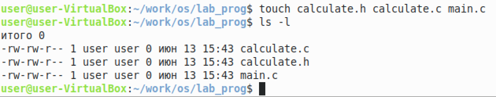
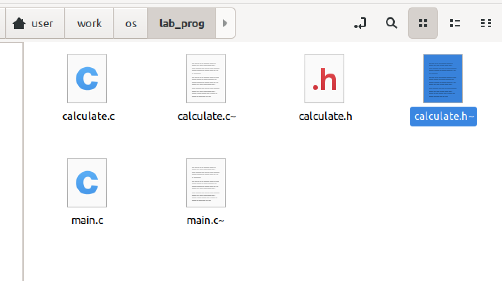
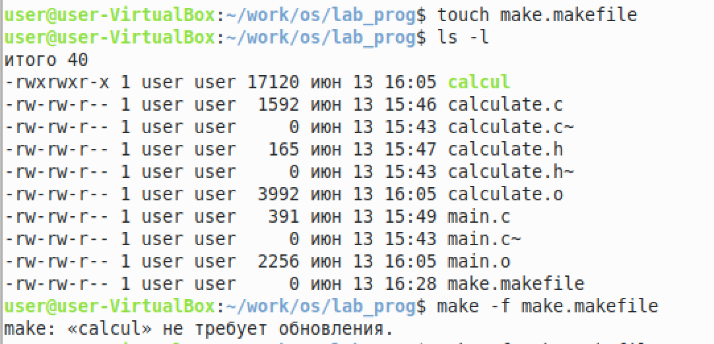
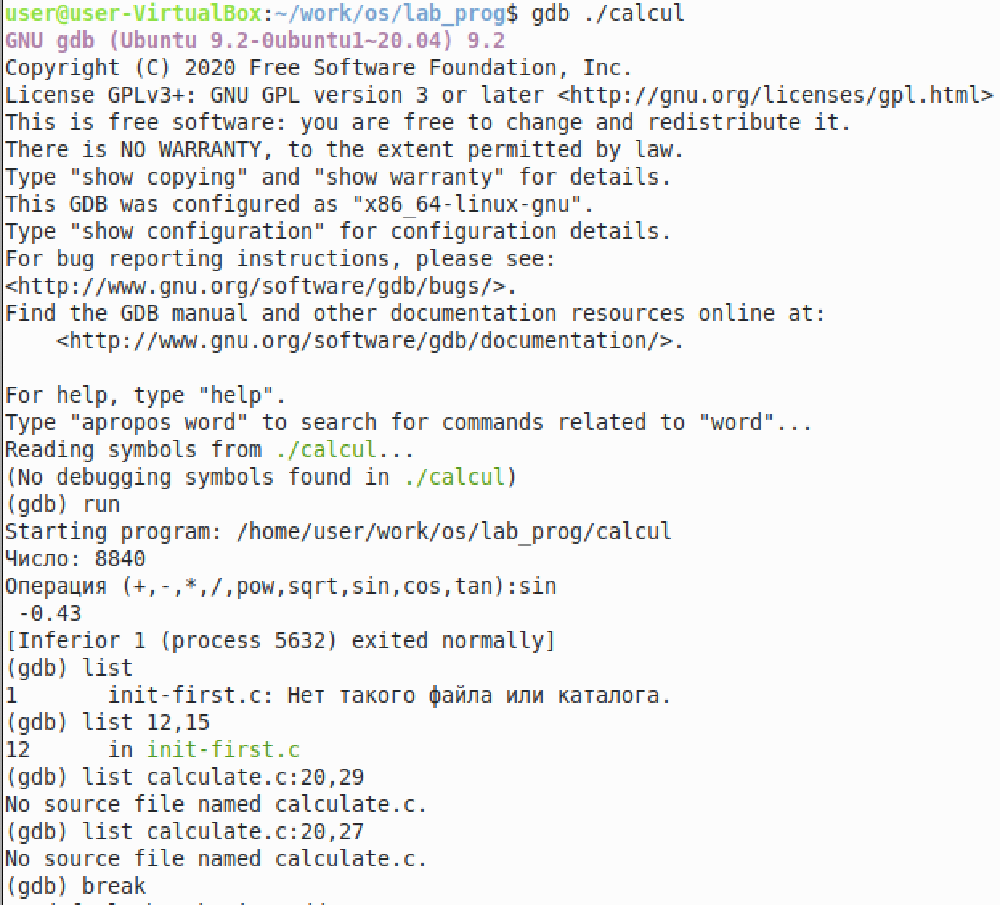
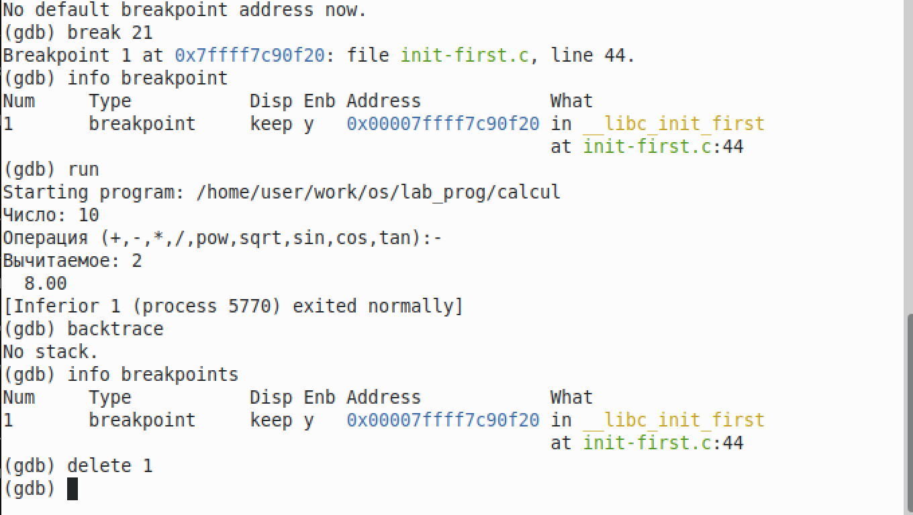
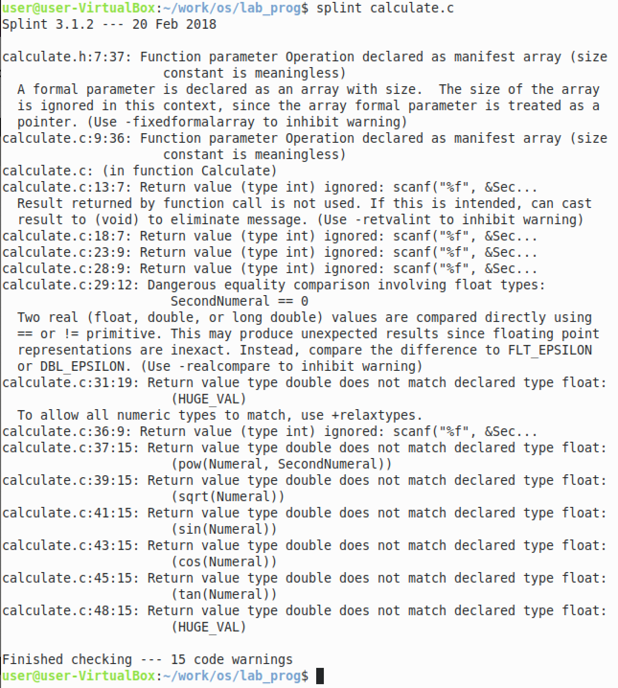
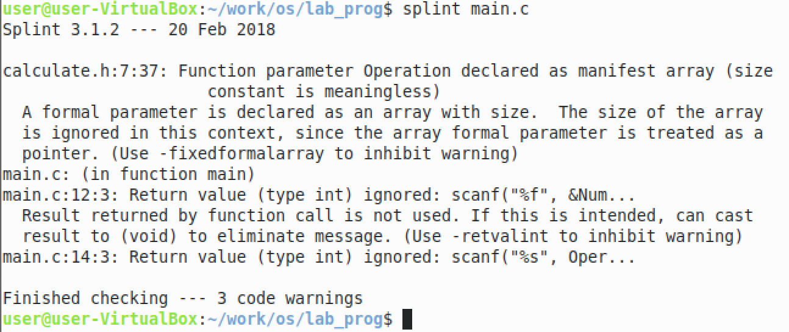

РОССИЙСКИЙ УНИВЕРСИТЕТ ДРУЖБЫ НАРОДОВ

Факультет физико-математических и естественных наук

Кафедра прикладной информатики и теории вероятностей
    

ОТЧЕТ
 

ПО ЛАБОРАТОРНОЙ РАБОТЕ №6
 

дисциплина:Операционные системы
      

Студент: Мартемьянов Александр
 

Группа: НПМбв-02-18
      

МОСКВА
 

2022 г.
 

>**2)Задание**

Приобрести простейшие навыки разработки, анализа, тестирования и отладки
приложений в ОС типа UNIX/Linux на примере создания на языке программирования С калькулятора с простейшими функциями.

>**3) Последовательность выполнения работы**

1. В домашнем каталоге создайте подкаталог ~/work/os/lab_prog.

  

Рис 3.  1 «Создание каталога»

2. Создайте в нём файлы: calculate.h, calculate.c, main.c.
Это будет примитивнейший калькулятор, способный складывать, вычитать,умножать и делить, возводить число в степень, брать квадратный корень, вычислять sin, cos, tan. При запуске он будет запрашивать первое число, операцию,второе число. После этого программа выведет результат и остановится.
3. Выполните компиляцию программы посредством gcc:

gcc -c calculate.c

gcc -c main.c

gcc calculate.o main.o -o calcul -lm

  

Рис 3.  2 «Создание исполняемых файлов»

  

Рис 3.  3 «Запуск исполняемых файлов»

4. При необходимости исправьте синтаксические ошибки.

Синтаксических ошибок не обнаружено

5. Создайте Makefile со следующим содержанием:

  

Рис 3.  5 «Создание makefile»

6. С помощью gdb выполните отладку программы calcul (перед использованием
gdb исправьте Makefile):

  

Рис 3.  6 «Отладка программы»

  

Рис 3.  7 «Отладка программы»

7. С помощью утилиты splint попробуйте проанализировать коды файлов
calculate.c и main.c.

  

Рис 3.  8 «Отладка программы»

  

Рис 3.  9 «Отладка программы»

>**5) Ответы на контрольные вопросы**
1. Как получить информацию о возможностях программ gcc, make, gdb и др.?

Можно использовать стандартные команды для получения справки - man gcc, man make, man gdb ну или вместо утилиты man использовать команду --help

2. Назовите и дайте краткую характеристику основным этапам разработки приложений в UNIX.

Основные этапы разработки приложений в Unix: Создание исходного кода (написание в IDE) -> Сохранение промежуточных файлов или альтернативных веток разработки исходного кода -> Компиляция исходных файлов или их интерпритация в зависимости от выбранного языка программирования и/или системы сборки проектов -> Тестирование проекта который был собран -> Запись в соответствующую ветку разработки Git (main или dev, по-умолчанию)

3. Что такое суффикс в контексте языка программирования? Приведите примеры
использования.

Суффикс - нужен для определения расширения в контексте файловой системы или компилятора с помощью которого будет производиться компиляция или интерпретация исходного кода в работающую программу (например hello1.py компилируется только ipython, а вот hello2.c компилируется только gcc, Cmake)

4. Каково основное назначение компилятора языка С в UNIX?

Компилятор Си предназначен для компиляции внутренних файлов системы без полного скачивания программ, а просто скачав исходный код системных утилит и произвести с помощью встроенного компилятора компиляцию системных утилит

5. Для чего предназначена утилита make?

Утилита make - предназначена для упрощения разработки приложений, путем написания файла конфигурации который описывает пути компиляции для компилятора языка программирования

6. Приведите пример структуры Makefile. Дайте характеристику основным элементам этого файла.

№№№№Можно использовать пример из лабараторной работы

7. Назовите основное свойство, присущее всем программам отладки. Что необходимо сделать, чтобы его можно было использовать?

Пошаговая отладка программ (трассировка) - её суть заключается в пошаговом выполнении каждой строчки кода

8. Назовите и дайте основную характеристику основным командам отладчика gdb.

    Основные команды отладчика gdb:

    backtrace - вывод на экран путь к текущей точке останова.
    break - установить точку останова (строка или функция)
    clear - удалить все точки останова в функции
    ontinue - продолжить выполнение программы
    delete (n) - удалить точку останова
    display - добавить выражение в список выражений, значения которых отображаются при достижении точки останова программы
    finish - выполнить программу до момента выхода из функции
    info breakpoints - вывести на экран список используемых точек останова
    info watchpoints - вывести на экран список используемых контрольных выражений
    list - вывести на экран исходный код (в качестве параметра может быть указано название файла и через двоеточие номера начальной и конечной строк)
    next - выполнить программу пошагово, но без выполнения вызываемых в программе функций
    print - вывести значение указываемого в качестве параметра выражения
    run - запуск программы на выполнение
    set[variable] - установить новое значение переменной
    step - пошаговое выполнение программы
    watch - установить контрольное выражение, при изменении значения которого программа будет остановлена

9. Опишите по шагам схему отладки программы, которую Вы использовали при выполнении лабораторной работы.

Мои действия при отладке программ: Запустил Makefile -> Начал отладку (run) -> Вывел содержимое main файла -> Установил точку останова в main файле -> Продолжил выполнение (run) -> Использовал команды print & display для вывод промежуточных данных -> Удалил точку останова -> Закончил отладку

10. Прокомментируйте реакцию компилятора на синтаксические ошибки в программе при его первом запуске.

Нейтральная реация компилятора, т.е. программных ошибок обнаружено не было

11. Назовите основные средства, повышающие понимание исходного кода программы.

cppcheck, splint, cscope и другие

12. Каковы основные задачи, решаемые программой splint?

Проверка корректности аргументов и поиск ошибок и значений в программе которые могут быть улучшены, а также оценка всей программы