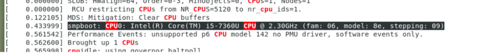

            		**РОССИЙСКИЙ УНИВЕРСИТЕТ ДРУЖБЫ НАРОДОВ**
    
    		**Факультет физико-математических и естественных наук**
    
    		**Кафедра прикладной информатики и теории вероятностей**

                         **ОТЧЕТ** 
    
                **ПО ЛАБОРАТОРНОЙ РАБОТЕ №3** 	
    
             *дисциплина:Операционные системы*		 

                                    																																		Студент: Мартемьянов Александр                                    
    
                                    																																		Группа: НПМбв-02-18                                      

                                **МОСКВА**
    
                                   2022 г.

>**2)Задание**

Целью данной работы является приобретение практических навыков установки операционной системы на виртуальную машину, настройки минимально необходимых для дальнейшей работы сервисов.

>**3) Описание результатов выполнения задания**

Для начала, создаем виртуальную машину и даем ей имя в соответствии с названием учетной записи **Рис 3. 1**

**Рис 3. 1 "Имя машины и тип ОС"**

Выделяем для «ВМ» необходимый объем оперативной памяти **Рис 3. 2**

**Рис 3. 2 «Размер основной памяти»**

Создаем новый виртуальный жесткий диск **Рис 3. 3**

**Рис 3. 3 «Окно подключения или создания жёсткого диска на виртуальной машине»**

Выбираем формат виртуального диска «VDI» **Рис 3. 4**

**Рис 3. 4 «Окно определения типа виртуального жёсткого диска»**

И делаем виртуальный диск динамическим **Рис 3. 5**

**Рис 3. 5«Окно определения формата виртуального жёсткого диска»**

Выделяем под виртуальный жесткий диск необходимый объем памяти **Рис 3. 6**

**Рис 3. 6«Окно определения размера виртуального динамического жёсткого диска и его расположения»**

Добавляем образ оптического диска, для его установки **Рис 3. 7**

**Рис 3. 7  «Носители» виртуальной машины: выбор образа оптического диск»**

Запускаем виртуальную машину

Далее, после загрузки мастера установки нужно поменять некоторые настройки **Рис 3. 8**

**Рис 3. 8«Окно настройки установки образа ОС»**

В окне выбора программ, выберем «Server with GUI и Development Tools» **Рис 3. 9**

**Рис 3. 9«Окно настройки установки: выбор программ»**

Отключим KDUMP **Рис 3. 10**

**Рис 3. 10 «Окно настройки установки: отключение KDUMP»**

Проверим расположение установки ОС **Рис 3. 11**

**Рис 3. 11 «Окно настройки установки: место установки»**

В параметрах сети, поменяем имя узла **Рис 3. 12**

**Рис 3. 12 «Окно настройки установки: сеть и имя узла»**

В процессе установки операционной системы **Рис 3. 13** зададим пароль для cуперпользователя **Рис 3. 14** и создадим нового пользователя с правами администратора **Рис 3. 15**

**Рис 3. 13 «Окно конфигурации пользователей»**

**Рис 3. 14 «Установка пароля для root»**

**Рис 3. 15 «Установка пароля для пользователя с правами администратора»**

После установки и перезагрузки ОС **Рис 3. 16**  нужно принять лицензию **Рис 3. 17**

**Рис 3. 16 «Первоначальная настройка ОС»**

**Рис 3. 17 «Первоначальная настройка ОС: лицензия»**

Далее подключить образ диска дополнений гостевой ОС **Рис 3. 18**

**Рис 3. 18 «Подключение образа диска дополнений гостевой ОС»**

После загрузки дополнений нажимаем enter и корректно перезагружаем «ВМ» **Рис 3. 19**

**Рис 3. 19 «Завершение подключения образа диска дополнений гостевой ОС»**

>3.1)Выполнение домашнего задания

Посмотрим последовательность загрузки системы, выполнив команду dmesg | less **Рис 3.1. 1**

**Рис 3.1. 1 «Вывод команды dmesg | less»**

Так же можем использовать поиск, используя команду dmesg | grep -I “Linux version” **Рис 3.1. 2**

**Рис 3.1. 2 «Вывод команды dmesg | grep -I “linux version”»**

Найдем по заданию другие искомые параметры

Посмотрим модель и частоту используемого процессора, с помощью команды dmesg | grep -I “smpboot” **Рис 3.1. 3**

**Рис 3.1. 3 «Вывод команды dmesg | grep -I “smpboot”»**

Далее посмотрим тип доступной оперативной памяти, с помощью команды dmesg | grep -I “memory” **Рис 3.1. 4**

**Рис 3.1. 4 «Вывод команды dmesg | grep -I “memory”»**

Найдем тип обнаруженного гипервизора, с помощью команды dmesg | grep -I “hypervisor detected” **Рис 3.1. 5**

**Рис 3.1. 5 «Вывод команды dmesg | grep -I “hypervisor detected”»**

Посмотрим тип файловой системы корневого раздела, с помощью команды lsblk -f  **Рис 3.1. 6**

**Рис 3.1. 6 «Вывод команды lsblk -f»**

Найдем последовательность монтирования файловых систем, с помощью команды mount  **Рис 3.1. 7**

**Рис 3.1. 7 «Вывод команды mount»**

>**4) Выводы согласованные с заданием работы**

В результате выполнения этой работы мы приобрели практические навыки установки операционной системы на виртуальную машину, настройки минимально необходимых для дальнейшей работы сервисов, выполнили домашнее задание.

>**5)Ответы на контрольные вопросы**

Какую  информацию содержит учётная запись пользователя? 

    Учетная запись содержит сведения, необходимые для идентификации пользователя при подключении к системе, а также информацию для авторизации и учёта.

Укажите команды терминала и приведите примеры:

– для получения справки по команде;

    Если мы хотим получить справку по команде - нам нужно использовать флаги -h или – help
    
    Например dmesg – h или wget -help.  

– для перемещения по файловой системе;

    Для перемещения по файловой системе linux используется команда cd – перемещение к указанной директории. 

– для просмотра содержимого каталога;

    Для вывода структуры текущей директории используется команда - ls

– для определения объёма каталога;

Для определения размера каталога можно использовать команду ls с флагом -al или с флагом -l

– для создания/удаления каталогов/файлов;

    Для создания файлов используется команда touch – например touch /home/user/text.txt
    
    Создание каталогов выполняется командой mkdir и название директории.

– для задания определённых прав на файл/каталог; 

    Для этого используется команда chmod в 2 режимах:
    
    В абсолютном режиме используется цифровое представление
    
    Read - 4, Write - 2, Execute - 1 – для такого представления команда которая будет давать права на чтение, запись и выполнение будет выглядеть так : chmod 755 /somefile
    
    В относительном режиме сначала указываем для кого меняем разрешения пользователю (u), группе(g) и другими (o)
    
    Затем используем оператор для добавления или удаления прав
    
    В конце используем r, w и x  для указания разрешений
    
    Например вот так : chmod +x somefile или вот так chmod g+w,o-r somefile

–для просмотра истории команд.

    Для просмотра истории команд можно воспользоваться стрелкой вверх на клавиатуре или командой history. 

Что такое файловая система? Приведите примеры с краткой характеристикой.

    Это инструмент, позволяющий операционной системе и программам обращаться к нужным файлам и работать с ними. 

Основные функции операционной системы :

    Поиск файла при запросе программ, 
    
    Создание, чтение и удаление файлов, 
    
    Работа с атрибутами файлов: изменение названия, размера,
    
    Определение права доступа к файлам, 
    
    Восстановление информации в случае сбоев.

Как посмотреть, какие файловые системы подмонтированы в ОС?

    Это можно посмотреть используя вывод команд lsblk иди blkid

Как удалить зависший процесс?

    Зависший процесс можно завершить командой pkill и название команды.