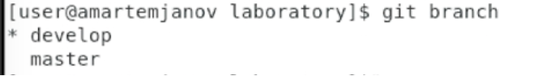

                        **РОССИЙСКИЙ УНИВЕРСИТЕТ ДРУЖБЫ НАРОДОВ**

                 **Факультет физико-математических и естественных наук**

                 **Кафедра прикладной информатики и теории вероятностей**

                                        **ОТЧЕТ** 

                                **ПО ЛАБОРАТОРНОЙ РАБОТЕ №** 	

                             *дисциплина:Операционные системы*		 

                                                    Студент: Мартемьянов Александр                                    

                                                    Группа: НПМбв-02-18                                      

                                        **МОСКВА**

                                          2022 г.

>**2)Задание**

Целью данной работы является изучить идеологию и применение средств контроля версий.

>**3) Описание результатов выполнения задания**

Для начала выполнения работы создадим аккаунт на [https://github.com/]()

Рис 3.  1 «Главная страница [https://github.com/»]()

Создадим репозиторий на GitHub с названием os-intro

Рис 3.  2 «Созданный репозиторий os-intro»

Переходим в ранее созданный каталог «laboratory»

Рис 3.  3 «Каталог laboratory»

Из текущего каталога инициализируем системы git

Рис 3.  4 «Инициализация системы Git»

Создаем заготовку для файла README.md и добавляем его в git

Рис 3.  5 «Создание файла README.md и добавление в локальный репозиторий»

Добавляем комментарий к файлу и публикуем его на созданный ранее репозиторий на  GitHub

Рис 3.  6 «Создаем комментарий и публикация на репозитории»

После загрузки можем увидеть что файл опубликовался на репозитории с созданным комментарием

Рис 3.  7 «Файл загруженный на репозиторий»

Добавляем файлы лицензий

Рис 3.  8 «Добавление файла лицензии»

Добавляем файл исключений

Рис 3.  9 «Добавление файла исключений»

Также добавляем файл исключений для «С» и запишем его в файл .gitignore

Рис 3.  10 «Добавляем файл исключений и записываем в файл .gitignore»

Далее добавляем файлы в git, комментируем и публикуем на созданном репозитории

Рис 3.  11 «Добавление, комментирование и публикация произведенных изменений»

Файлы опубликованные на репозитории

Рис 3.  12 «Опубликованные на репозитории файлы»

Далее инициализируем git flow и устанавливаем ветки ярлыков в v

Рис 3.  13 «Инициализируем git flow и устанавливаем ярлыки в v»

Проверяем что мы на ветке develop

Рис 3.  14 «Проверка нахождения на ветке develop»

Создаем релиз с версией 1.0.0

Рис 3.  15  «Создание релиза с версией 1.0.0»

Записываем версию с помощью команды echo

Рис 3.  16 «Запись версии»

Добавим все изменения в git и создадим комментарий

Рис 3.  17 «Добавление изменений и создание комментария»

Закроем релиз 

Рис 3.  18 «Закрытие релиза»

В данном случае закрыть релиз не получается из за ошибки, опубликуем релиз без его завершения

Рис 3.  19 «Публикация релиза на репозитории»

Перейдя в репозиторий, видим что версия опубликована

Рис 3.  20 «Опубликованный релиз на GitHub»

>**4) Выводы согласованные с заданием работы**

В результате выполнения этой работы мы приобрели практические навыки идеологии и применения средств контроля версий ,ответили на контрольные вопросы

>**5) Ответы на контрольные вопросы**

Что такое системы контроля версий (VCS) и для решения каких задач они предназначаются?

    Система контроля версий — это система, записывающая изменения в файл или набор файлов в течение времени и позволяющая вернуться позже к определённой версии.

    Они применяются для решения задачи хранения различных версий файлов в процессе работы над ними, для минимизации потери данных при применении некорректных изменений в эти файлы.

Объясните следующие понятия VCS и их отношения: хранилище,commit,история, рабочая копия.

    Хранилище VCS – это локальное расположение где хранятся файлы

    Commit в VCS – это инструмент для комментирования сделанных изменений

    В истории можно посмотреть все ранее внесенных изменения в файлы

    Рабочая копия делается для того что бы иметь полный бекап данных при работе с файлами

    Все эти инструменты тесно связаны в работе над одними файлами группы пользователей

Что представляют собой и чем отличаются централизованные и децентрализованные VCS? Приведите примеры VCS каждого вида.

**Централизованные VCS**
    
    Основаны на одном репозитории и  взаимодействуют с ним по сети – пример *CVS- одна из первых систем второго поколения (1986г.).Считается устревшей* 

    *Subversion (SVN) – система второго поколения, созданная для замены CVS. Одна из самых распространенных систем контроля версий.*

**Децентрализованные** или **распределенные** **VCS**    

    Имеют несколько репозиториев, которые время от времени синхронизируются между собой – пример Git- распределенная система управления версиями, созданная Л. Торвальдсом для управления разработкой ядра Linux.

    Mercurial- другая распределенная VCS. Создана в 2005 году М. Макалом практически одновременно с началом разработки git’а и с аналогичными целями

Опишите действия с VCS при единоличной работе с хранилищем.

    1. Инициализировать VCS в нужном каталоге, указать контакты владельца репозитория. (git init)
    2. Создать необходимые файлы (echo ‘’)
    3. Добавить их в репозиторий (git add file.txt, git add .)
    4. Добавить commit к файлам (git commit ‘new file’)

Опишите порядок работы с общим хранилищем VCS.

    Перед началом работы с сервером репозиториев нам нужно сгенерировать SSH ключи и добавить их на сетевом репозитории, например на Github (ssh-keygen -C "Имя Фамилия <work@mail>") и указать данные владельца ключа

    1. Инициализировать VCS в нужном каталоге, указать контакты владельца репозитория. (git init)
    2. Создать необходимые файлы (echo ‘’,curl -L >> curl filename)
    3. Добавить их в репозиторий (git add file.txt, git add .)
    4. Добавить commit к файлам (git commit ‘new file’)
    5. Загрузить изменения на удаленный репозиторий, с помощью ранее созданного ssh ключа (git remote add origin ssh://git@github.com/<username>/<reponame>.git и далее git push -u origin master)

Каковы основные задачи, решаемые инструментальным средством git?

    Основные решаемые задачи при работе с git вернуть файлы к состоянию, в котором они были до изменений, вернуть проект к исходному состоянию, увидеть изменения, увидеть, кто последний менял что-то и вызвал проблему, кто поставил задачу и когда и многое другое.

Назовите и дайте краткую характеристику командам git.

    - git init - создание основного дерева репозитория
    - git push - отправка всех произведённых изменений локального дерева в центральный репозиторий
    - git pull - получение обновлений (изменений) текущего дерева из центрального репозитория
    - git status - просмотр списка изменённых файлов в текущей директории:
    - git add - добавить все изменённые и/или созданные файлы и/или каталоги
    - git add имена\_файлов -	добавить конкретные изменённые и/или созданные файлы и/или каталоги
    - git rm имена\_файлов – удалить файл и/или каталог из индекса репозитория
    - git commit -am 'Описание коммита' - сохранить все добавленные изменения и все изменённые файлы
    - git checkout имя\_ветки - переключение на некоторую ветку
    - git checkout -b имя\_ветки - создание новой ветки, базирующейся на текущей
    - git push origin имя\_ветки  - отправка изменений конкретной ветки в центральный репозиторий
    - git merge --no-ff имя\_ветки - слияние ветки с текущим деревом

Приведите примеры использования при работе с локальным и удалённым репозиториями.

**Пример с локальным репозиторием**:

    git config --global user.name "Name Surname" 

    git config --global user.email "work@mail"

    из локального каталога – git init

    echo 'hello world' > hello.txt 

    git add hello.txt 

    git commit – am ‘new file’

**Пример с удаленным репозиторием**:

    Будем использовать основу от работы с локальным репозиторием

    git config --global user.name "Name Surname" 

    git config --global user.email "work@mail"

    из локального каталога – git init

    echo 'hello world' > hello.txt 

    git add hello.txt 

    git commit – am ‘new file’

    git remote add origin ssh://git@github.com/<username>/<reponame>.git

    git push -u origin master

Что такое и зачем могут быть нужны ветви(branches)?

    Ветки нужны для того, чтобы программисты могли вести совместную работу над проектом и не мешать друг другу при этом. При создании проекта, Git создает базовую ветку. Она называется master веткой.

Как и зачем можно игнорировать некоторые файлы при commit?

    Игнорируемые файлы — это, как правило, артефакты сборки и файлы, генерируемые машиной из исходных файлов в вашем репозитории, либо файлы, которые по какой-либо иной причине не должны попадать в коммиты. В Git нет специальной команды для указания игнорируемых файлов: вместо этого необходимо вручную отредактировать файл .gitignore, чтобы указать в нем новые файлы, которые должны быть проигнорированы.
