                        **РОССИЙСКИЙ УНИВЕРСИТЕТ ДРУЖБЫ НАРОДОВ**
    
                 **Факультет физико-математических и естественных наук**
    
                 **Кафедра прикладной информатики и теории вероятностей**

                                        **ОТЧЕТ** 
    
                                **ПО ЛАБОРАТОРНОЙ РАБОТЕ №4** 	
    
                             *дисциплина:Операционные системы*		 

                                                    Студент: Мартемьянов Александр                                    
    
                                                    Группа: НПМбв-02-18                                      

                                        **МОСКВА**
    
                                          2022 г.

>**2)Задание**

Познакомиться с операционной системой Linux, получить практические навыки рабо-  
ты с консолью и некоторыми графическими менеджерами рабочих столов операционной  
системы.

>**3) Последовательность выполнения работы**

С теоретическим метериалом ознакомились, далее нам надо загрузить компьютер и перейти на первую текстовую консоль (tty1) с помощью:

    CTRL+ALT+FN+F1

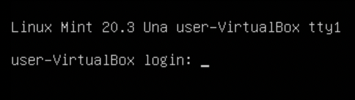

Рис 3.  1 «Первая текстовая консоль (tty1)»

На моем компьютере доступно 6 виртуальных консолей в текстовом режиме

Далее нам нужно перемещаться по виртуальным консолям, это делается с помощью указания номера консоли (tty) при вооде "сочетания горячих клавиш"

    CTRL+ALT+FN+F1-F6

| 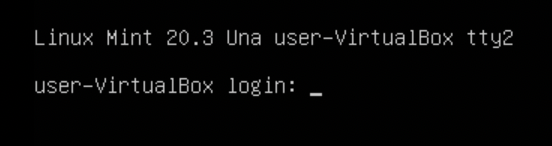 |
------ | ------
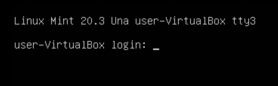  | 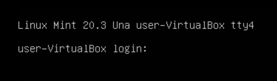 |

Рис 3.  2 «Переход между консолями»

Далее нам нужно зарегистрироваться в системе - вводим логин пользователя:
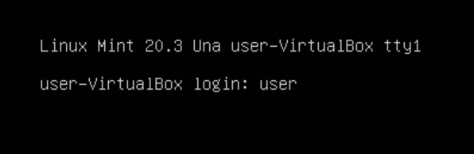

Рис 3.  3 «Ввод логина пользователя»

и пароль от учетной записи:

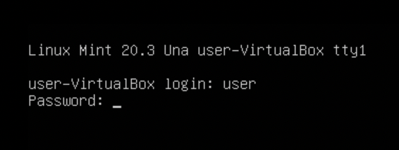

Рис 3.  4 «Ввод пароля от учетной записи»

При вводе логина использовали имя пользвователя "user" (uid 1000 "user") и пароль от учетной записи, при этом при вводе пароля мы не видим вводимые символы в целях безовапасности.

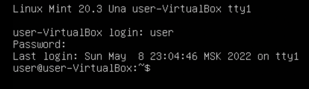

Рис 3.  5 «Пользователь зарегистрирован в системе»

Далее завершаем консольный сеанс

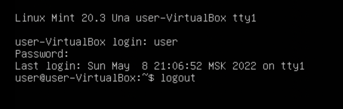

Рис 3.  6 «Завершение сеанса командой "logout"»

Сделать это можно либо командой "logout" или используя комбинацию клавиш :
    
    CTRL+D

Рис 3.  7 «Выход из учетной записи выполнен"»

Далее переключаемся на графический интерфейс,для переключения используем комбинацию:

    CTRL+Alt+Fn+F7

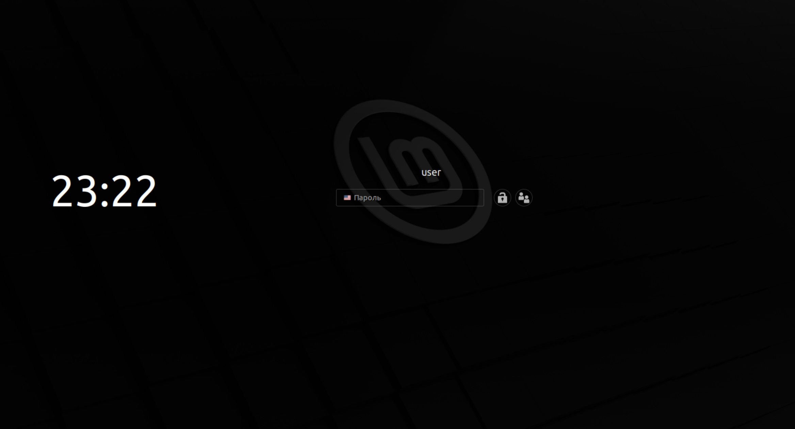

Рис 3.  8 «Переключение на графический интерфейс»

Видим менеджер рабочего стола:

Рис 3.  9 «Менедженр рабочего стола Linux Mint»

По умолчанию менеджером рабочего стола в системе используется "Cinnamon"а менеджером окон является "mutter" или "muffin"

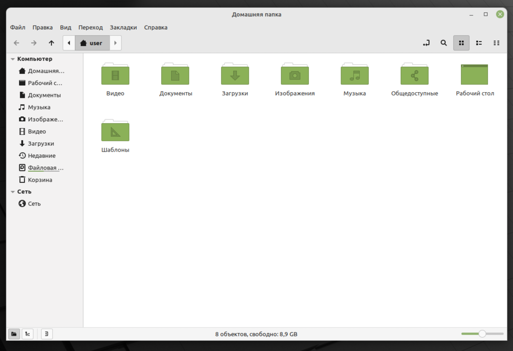

Рис 3.  10 «Менедженр рабочего стола Linux Mint»

Далее зарегистрируемся в других менеджерах рабочих столов и посмотрим на их отличия

Первым попробуем "Gnome" - как видим изменилась панель приложений,она теперь сверху ,меню часто используемых приложений появляется слева при нажатии на кнопку "Обзор",а если нажать на кнопку "все приложения" появится список всех приложений

Рис 3.  11 «Менеджер рабочего стола gnome»

Также справа есть панель для работы с несколькими рабочими столами

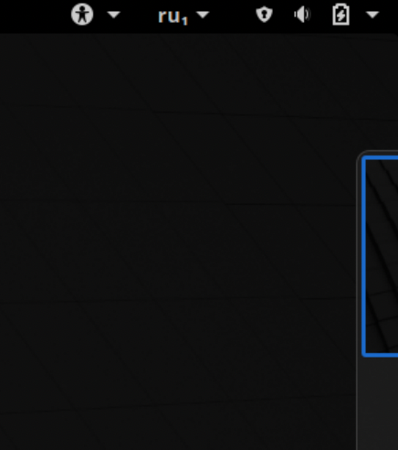

Рис 3.  12«Панель для работы с рабочими столами»

В качестве оконного менеджера gnome использует тот же "mutter" только с темой от менеджера рабочего стола gnome

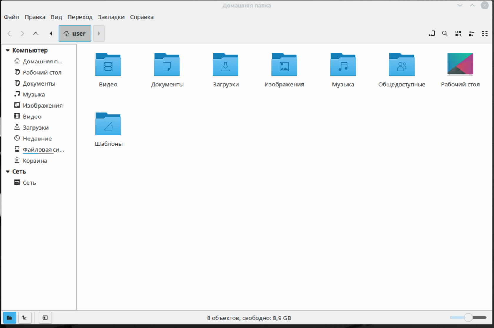

Рис 3.  13«Оконный менеджер "mutter" в окрудении gnome»

Далее посмотрим на менеджен рабочего стола KDE

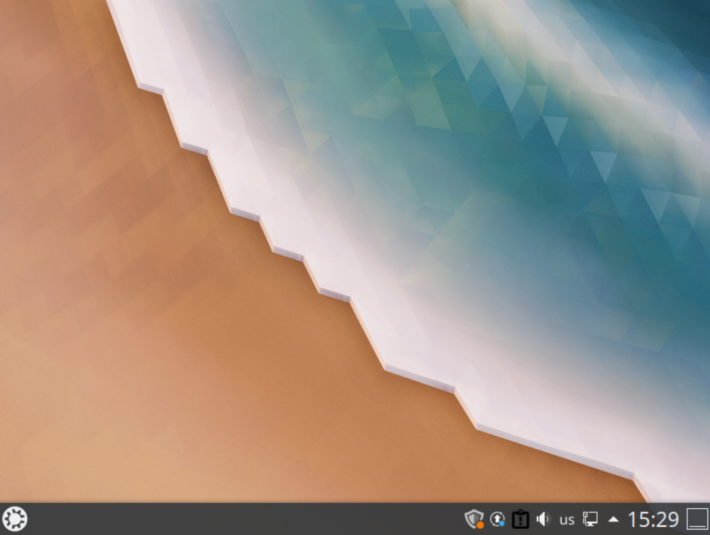

Рис 3.  14«Менеджер рабочего стола KDE Plasma»

Интерфейс в KDE Plasma более привычный пользователям windows, у этого менеджера рабочих столов есть привычная панель снизу, и аналог меню "пуск"

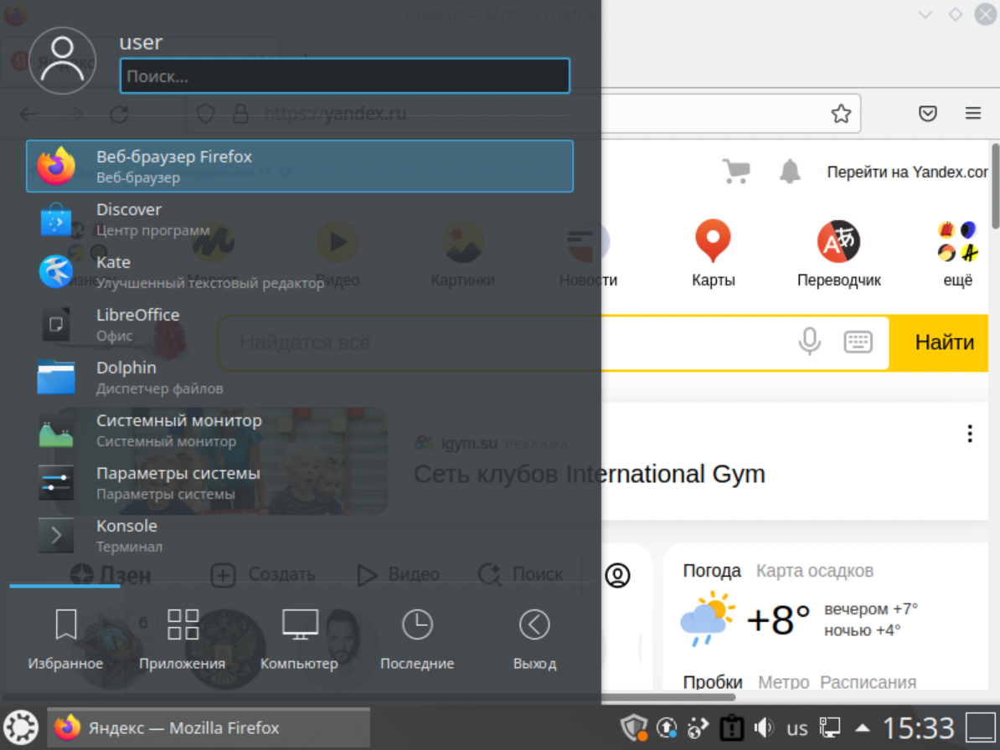

Рис 3.  15«Меню приложений KDE Plasma»

KDE использует менеджер рабочего стола "DE Plasma" и оконный менеджер "wm kwin"

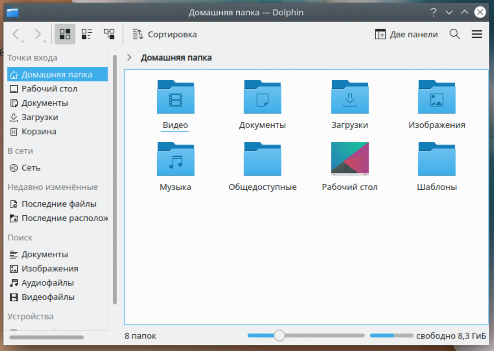

Рис 3.  16«Оконный менеджер kwin в менеджере рабочих столов DE Plasma»

Далее взглянем на xfce. У него панель задач похожа на используемую в KDE Plasma, но более простая и легковестная.

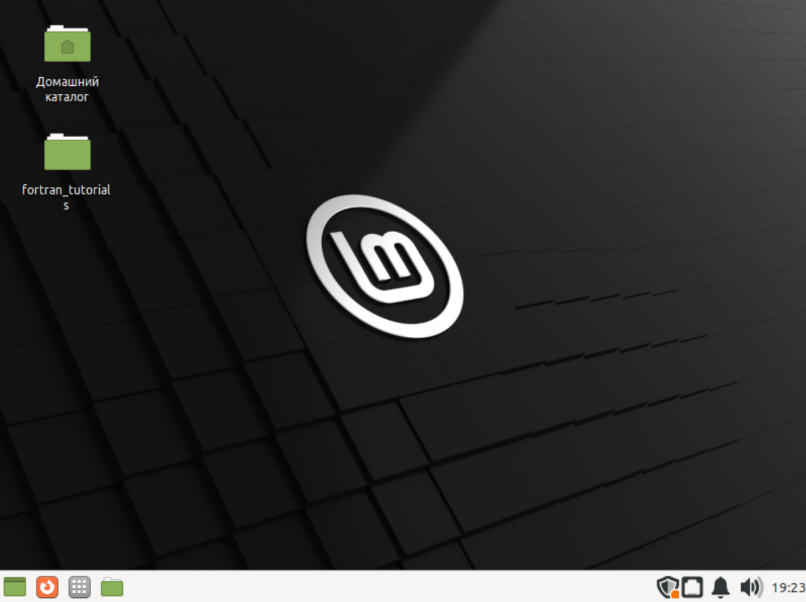

Рис 3.  17«Менеджер рабочего стола xfce»

xfce использует оконный менеджер "thunar"

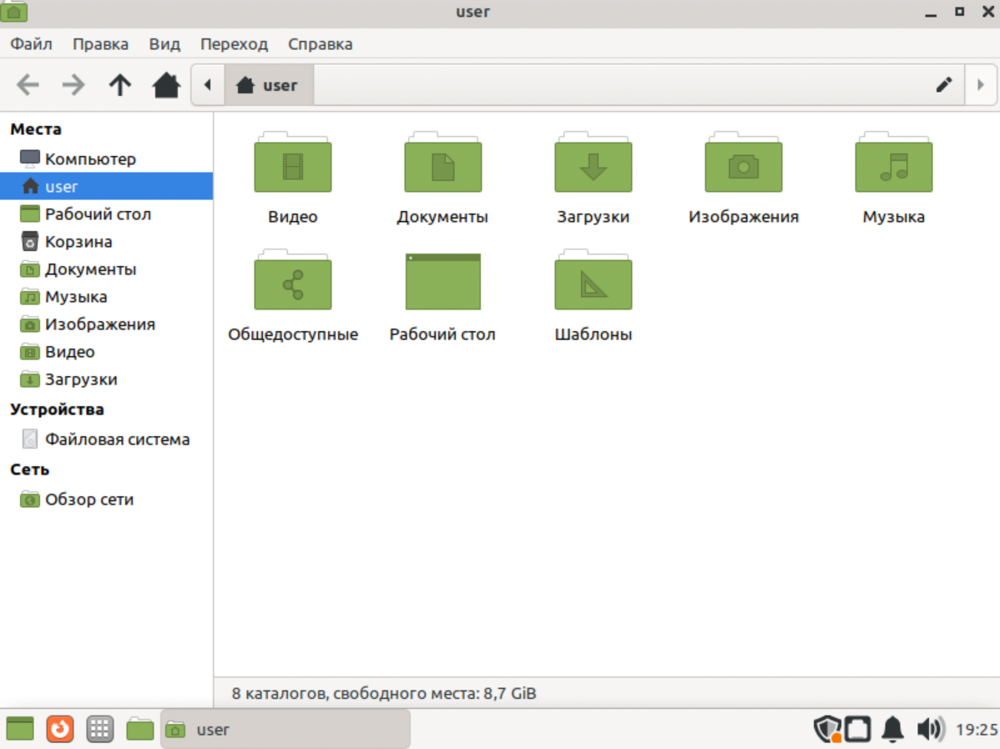

Рис 3.  18«Оконный менеджер xfce»

Далее посмотрим на openbox

Если использовать голый openbox, мы получаем только меню по клику на рабочем столе,никаких спецэффектов, обоев, панелей - окружение рабочего стола по умолчанию не установлено в openbox

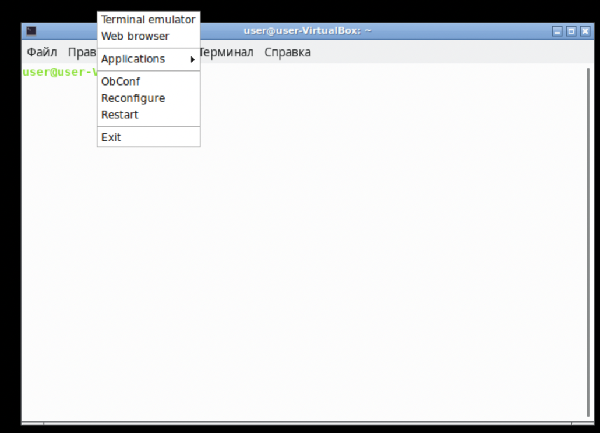

Рис 3.  19«Оконный менеджер openbox»

На моем компьютере установлены все перечисленные DE и WM это - GNOME, KDE Plasma, XFCE,Cinnamon и openbox

Далее по заданию указываю установленные по списку программы это:

программы | |
------ | ------|
браузер|firefox
текстовой редактор|xed
текстовой процессор|LibreOffice
эмулятор консоли|терминал gnome

>**4) Выводы согласованные с заданием работы**

В результате выполнения этой работы мы приобрели практические навыки при знакомстве с операционной системой Linux, получили практические навыки работы с консолью и некоторыми графическими менеджерами рабочих столов операционной
системы.

>**5) Ответы на контрольные вопросы**

Что такое компьютерный терминал?
Есть ли, по вашему мнению, у него преимущества
перед графическим интерфейсом?

    Компьютерный терминал — устройство ввода–вывода, основные функции которого заключаются в вводе и отображении данных.
    Да, есть - большое колличество расширенных функций, команд и настроек.

Что такое входное имя пользователя?

    Входное имя пользователя (Login) — название учётной записи пользователя

В каком файле хранятся пароли пользователей? В каком виде они хранятся?

    Пароли, в целях безопасности хранятся в файле по пути /etc/shadow в виде бинарного файла

Где хранятся настройки пользовательских программ?

    В домашнем каталоге пользователя

Какое входное имя у администратора ОС Unix?

    uid=0 gid=0 /root

Имеет ли администратор доступ к настройкам пользователей?

    да, при наличии повышенных прав

Каковы основные характеристики многопользовательской модели разграничения
доступа?

    -процедура регистрации в системе для Unix обязательна
    -для каждого пользователя определена сфера его полномочий в системе
    -разделяются обычные пользователи и администраторы
    -

Какую информацию кроме пароля и логина содержит учётная запись пользователя?

    Учётная запись пользователя содержит:
    – входное имя пользователя (Login Name)
    – пароль (Password)
    – внутренний идентификатор пользователя (User ID)
    – идентификатор группы (Group ID)
    – анкетные данные пользователя (General Information)
    – домашний каталог (Home Dir)
    – указатель на программную оболочку (Shell)

Что такое UID и GID? Расшифруйте эти аббревиатуры.

    Идентификатор пользователя в системе (User ID, UID) — положительное целое число в диапазоне от 0 до
    65535, по которому в системе однозначно отслеживаются действия пользователя.

    Group ID(GID) - идентификатор группы пользователей

Что такое GECOS?

    Анкетные данные пользователя (General Information или GECOS) являются необязательным параметром учётной записи и могут содержать реальное имя пользователя(фамилию, имя), адрес, телефон.

Что такое домашний каталог? Какие файлы хранятся в нем?

    Домашний каталог — это личный каталог пользователя в операционной системе

    В домашнем каталоге пользователя хранятся данные (файлы) пользователя, настрой-
    ки рабочего стола и других приложений. 

Как называется ваш домашний каталог?

    /home/user

Имеет ли администратор возможность изменить содержимое домашнего каталога
пользователя?

    да, при наличии повышенных прав

Что хранится в файле /etc/passwd?

    Учётные записи пользователей, имеет следующую структуру 
    van:x:1000:100::/home/ivan:/bin/bash

Как, просмотрев содержимое файла /etc/passwd, узнать, какие пользователи не
смогут войти в систему?

    Символ * в поле password некоторой учётной записи в файле
    /etc/passwd означает, что пользователь не сможет войти в систему.

Что такое виртуальные консоли? Как вы думаете, что означает слово «виртуальный»
в данном контексте?

    Виртуальные консоли — реализация концепции многотерминальной работы в рамках одного устройства.
    Виртуальность в данном контексте означает что пользователь может выполнять в этих консолях действия независымые друг от друга

Зачем нужна программа getty?

    Программа для UNIX-подобных операционных систем, управляющая доступом к физическим и виртуальным терминалам. Программа выполняет запрос имени пользователя и запускает программу 'login' для авторизации пользователя.

Что такое сеанс работы?

    Сеанс работы - период работы учётной записи пользователя между авторизацией и её завершением.

Что такое тулкит?

    Toolkit (Tk, «набор инструментов», «инструментарий»)— кроссплатформенная библиотека базовых элементов графического интерфейса, распространяемая
    с открытыми исходными текстами.

Какие основные тулкиты существуют в системе Unix?

    Используются следующие основные тулкиты:
    – GTK+ (сокращение от GIMP Toolkit) — кроссплатформенная библиотека элементов
    интерфейса;
    – Qt — кросс-платформенный инструментарий разработки программного обеспечения
    на языке программирования C++.
    GTK+ состоит из двух компонентов:
    – GTK — содержит набор элементов пользовательского интерфейса (таких, как кнопка,
    список, поле для ввода текста и т. п.) для различных задач;
    – GDK — отвечает за вывод информации на экран, может использовать для этого
    X Window System, Linux Framebuffer, WinAPI.
    На основе GTK+ построены рабочие окружения GNOME, LXDE и Xfce.
    Естественно, эти тулкиты могут использоваться и за пределами «родных» десктопных
    окружений.
    Qt используется в среде KDE (Kool Desktop Environment).