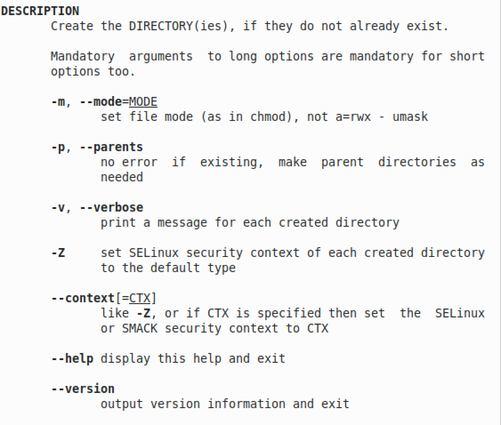

                        **РОССИЙСКИЙ УНИВЕРСИТЕТ ДРУЖБЫ НАРОДОВ**
    
                 **Факультет физико-математических и естественных наук**
    
                 **Кафедра прикладной информатики и теории вероятностей**

                                        **ОТЧЕТ** 
    
                                **ПО ЛАБОРАТОРНОЙ РАБОТЕ №5** 	
    
                             *дисциплина:Операционные системы*		 

                                                    Студент: Мартемьянов Александр                                    
    
                                                    Группа: НПМбв-02-18                                      

                                        **МОСКВА**
    
                                          2022 г.

>**2)Задание**

Приобретение практических навыков взаимодействия пользователя с системой
посредством командной строки.

>**3) Последовательность выполнения работы**

Для начала определим имя домашнего каталога, сделать это можно с помощью команды:

    pwd

Рис 3.  1 «Домашний каталог пользователя»

Далее перейдем в каталог /tmp

Рис 3.  2 «Каталог /tmp»

Выведем на экран содержимое каталога с различными опциями,сделать это можно с помощью команды:

    ls c опциями -a,-l и -F

Сначала введем команду 

    ls

В выводе этой команды видим содержимое каталога /tmp

Рис 3.  3 «Содердимое каталога /tmp»

Далее посмотрим на вывод команды с опцией -a, эта опция включает отображение скрытых файлов в директории

    ls -a

Рис 3.  4 «Содердимое каталога /tmp с опцией -a»

Далее посмотрим на вывод команды c опцией -l

    ls -l

Опция отображает дополнительную информацию о файлах в директории, такие как - тип файла,право доступа,число ссылок,владелец,
размер,дата последней ревизии,имя файла или каталога

Рис 3.  5 «Содердимое каталога /tmp с опцией -l»

Далее попробуем совместить все используемые параметры, команда будет выглядеть так:

    ls -alF
В выводе этой команды отображается содержимое каталога с отображением скрытых файлов вместе с дополительной информацией

Рис 3.  6 «Содердимое каталога /tmp с опцией -alF»

Проверим есть ли в каталоге /var/spool каталог с именем /cron

Вводим команды:

    cd /var/spool
    ls -alF

Видим что искомый каталог /cron есть в каталоге /var/spool

Рис 3.  7 «Содердимое каталога /var/spool с искомым каталогом cron»

Далее перейдем в домашний каталог, для этого можно ввести команду cd без аргументов или с аргументом ~

    cd или cd ~

И выведем его содержимое и определим кто является владельцем файлов и подкаталогов

    ls -alF

После вывода команды видимо содержимое домашнего каталога пользователя,и видим что владельцем файлов и каталогов является пользователь user

Рис 3.  8 «Содердимое домашнего каталога с дополнительными параметрами»

Далее создадим в домашнем каталоге каталог newdir

Проверим создание командой ls

Рис 3.  9 «Создание каталога newdir»

В каталоге newdir создадим еще один каталог morefun

Проверим что папка создалать командой ls

Рис 3.  10 «Создание подкаталога morefun в каталоге newdir »

Далее в домашнем каталоге создадим 3 папки с иманами letters, memos, misk

Проверим создание каталогов командой ls

Рис 3.  11 «Создание 3 каталогов в домашнем каталоге »

Удалим эти каталоги c помошью команды rmdir, проверим удаление командой ls

Рис 3.  12 «Удаление 3 каталогов »

Попробуем удалить ранее созданный каталог newdir с помощью команды rm

Видим ошибку, что мы не можем выполнить эту команду потому что newdir - каталог, поэтому каталог не был удален

Рис 3.  13 «Попытка удаления каталога newdir»

Для того что бы с помощью команды rm удалить папку можно использовать -R

Попробуем удалить из домашнего каталога newdir/morefun

Видим что каталог удалился вместе с подкаталогом morefun

Рис 3.  14 «Удаление каталога newdir с подкаталогом morefun»

Для того что бы просматривать в выводе команды ls не только каталоги но и подкаталоги можно указать знак *

Рис 3.  15 «Просмотр подкаталогов»

Для того что бы использовать сортировку по времени в выводе команды ls нужно добавить опцию -t

В выводе команды с опцией и без видим разницу в сортировке

Рис 3.  16 «Сортировка вывода по времени»

Далее посморим на основные опции команд с помощью команды man

Рис 3.  17 «Справка по команде cd»

Для cd на моей ос нет справочной страницы

Но у cd есть всего 2 опции

    -P - позволяет следовать по символическим ссылкам перед тем, как будут обработаны все переходы "..";
    -L - переходит по символическим ссылкам только после того, как были обработаны "..";

Далее посмотри на опции команды pwd

Рис 3.  18 «Справка по команде pwd»

У pwd есть следующие опции

    -L, --logical - брать директорию из переменной окружения, даже если она содержит символические ссылки;
    -P - отбрасывать все символические ссылки;
    --help - отобразить справку по утилите;
    --version - отобразить версию утилиты.

Далее посмотрим на справку команды mkdir и ее опции

Рис 3.  19 «Справка по команде mkdir»

У нее есть следующие опции

    -m (--mode=режим) - назначить режим доступа (права). По умолчанию mod принимает значение 0777, что обеспечивает неограниченные права.
    -p (--parents) - не показывать ошибки, а также их игнорировать.
    -z  (--context=CTX ) принимает контекст SELinux для каталога по умолчанию.
    -v (--verbose) - выводить сообщение о каждом новым каталоге.
    --help - вывести справочную информацию.
    --version - выводит информацию о текущей версии утилиты.

Далее посмотрим на команду rmdir и ее опции

Рис 3.  20 «Справка по команде rmdir»

Эта команда имеет следующие опции

    -p	Позволяет удалить каталог и вышележащие каталоги, оказавшиеся пустыми. На стандартный вывод выдается сообщение об удалении всех указанных в маршруте каталогов или о сохранении части из них по каким-либо причинам.
    -s	Подавление сообщения, выдаваемого при действии опции -p.

И вывод справки по команде rm

Рис 3.  21 «Справка по команде rm»

У нее есть следующие опции

    -f или --force Игнорировать несуществующие файлы и аргументы. Никогда не выдавать запросы на подтверждение удаления.
    -i Выводить запрос на подтверждение удаления каждого файла.
    -I Выдать один запрос на подтверждение удаления всех файлов, если удаляется больше трех файлов или используется рекурсивное удаление. Опция применяется, как более «щадящая» версия опции -i
    --interactive[=КОГДА] Вместо КОГДА можно использовать:
    never — никогда не выдавать запросы на подтверждение удаления.
    once — выводить запрос один раз (аналог опции -I).
    always — выводить запрос всегда (аналог опции -i).
    --one-file-system Во время рекурсивного удаления пропускать директории, которые находятся на других файловых системах.
    --no-preserve-root Если в качестве директории для удаления задан корневой раздел /, то считать, что это обычная директория и начать выполнять удаление.
    --preserve-root Если в качестве директории для удаления задан корневой раздел /, то запретить выполнять команду rm над корневым разделом. Данное поведение используется по умолчанию.
    -r или -R или --recursive Удаление директорий и их содержимого. Рекурсивное удаление.
    -d или --dir Удалять пустые директории.
    -v или --verbose Выводить информацию об удаляемых файлах.

Далее попробуем поменять несколько команд

Так в записи истории номер 259 мы меняем опцию команды ls с -alF на -alFt, а во втором случае в записи истории номер 154 меняем опцию команды cd с /tmp на /var

Рис 3.  21 «Замена вывода команд»
>**4) Выводы согласованные с заданием работы**

В результате выполнения этой работы мы приобрели практические навыки при взаимодействия пользователя с системой
посредством командной строки.

>**5) Ответы на контрольные вопросы**

Что такое командная строка?

    Коммандная строка - разновидность текстового интерфейса между человеком и компьютером, в котором инструкции компьютеру даются в основном путём ввода с клавиатуры текстовых строк
При помощи какой команды можно определить абсолютный путь текущего ка-
талога? Приведите пример.

    При помощи команды pwd
    пример user@user-VirtualBox:~$ pwd 
    /home/user

При помощи какой команды и каких опций можно определить только тип файлов
и их имена в текущем каталоге? Приведите примеры.

    Это можно сделать с помощью команды file *
    Пример user@user-VirtualBox:~$ file*
    Applications:           directory
    Desktop:                directory
    Documents:              directory
    Downloads:              directory
    Library:                directory

Какие файлы считаются скрытыми? Как получить информацию о скрытых фай-
лах? Приведите примеры.

    Скрытыми файлами в linux считаются файлы перед которыми стоит .
    Информацию о скрытых файлах можно получить с помощью команды ls и опции -a
    Пример user@user-VirtualBox:~$ ls -a
    .
    ..
    .bash_history

При помощи каких команд можно удалить файл и каталог? Можно ли это сделать
одной и той же командой? Приведите примеры.
    
    Файл можно удалить с помощью команды rm ,а если использовать опцию -R можно удалить каталог и вложенные каталоги
    Так же с помощью команды rmdir можно удалить пустой каталог
    Пример user@user-VirtualBox:~$ rm -R newdir
    user@user-VirtualBox:~$

Как определить, какие команды выполнил пользователь в сеансе работы?
    
    Для этого нужно выполнить команду history

Каким образом можно исправить и запустить на выполнение команду, которую
пользователь уже использовал в сеансе работы? Приведите примеры.
    
    Для этого нужно вывести список истории команд history затем указать номер команды и указать что и что заменить
    Пример !1:s/-alF/-alFt
Можно ли в одной строке записать несколько команд? Если да, то как? Приведите
примеры.
    
    да, можно
    Пример cd;ls
Что такое символ экранирования? Приведите примеры использования этого сим-
вола.
    
    Это символ который используют если в контексте встречаются симвалы .;,;/ и тд
    Пример !1:s\/tmp\/var - для команды cd когда в опции нужно поменять путь
Какая информация выводится на экран о файлах и каталогах, если используется
опция l в команде ls?

    тип файла,право доступа,число ссылок,владелец, размер,дата последней ревизии,имя файла или каталога

Что такое относительный путь к файлу? Приведите примеры использования от-
носительного и абсолютного пути при выполнении какой-либо команды.
    
    Абсолютный путь показывает точное местонахождение файла, а относительный показывает путь к файлу относительно какой-либо "отправной точки" (файл, программа и т. д.).
    Пример полного пути cd /home/user, и относительного cd ~/
Как получить информацию об интересующей вас команде?

    Нужно выполнить маманду man или вызвать --help или -h

Какая клавиша или комбинация клавиш служит для автоматического дополнения
вводимых команд?
    Для этого используют клавишу Tab