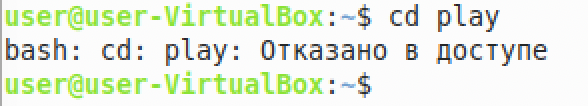

РОССИЙСКИЙ УНИВЕРСИТЕТ ДРУЖБЫ НАРОДОВ

Факультет физико-математических и естественных наук

Кафедра прикладной информатики и теории вероятностей
    

ОТЧЕТ
 

ПО ЛАБОРАТОРНОЙ РАБОТЕ №6
 

дисциплина:Операционные системы
      

Студент: Мартемьянов Александр
 

Группа: НПМбв-02-18
      

МОСКВА
 

2022 г.
 

>**2)Задание**

Ознакомление с файловой системой Linux, её структурой, именами и содержа-
нием каталогов. Приобретение практических навыков по применению команд для
работы с файлами и каталогами, по управлению процессами (и работами), по про-
верке использования диска и обслуживанию файловой системы.

>**3) Последовательность выполнения работы**

  1. Копирование файла в текущем каталоге. Скопировать файл ~/abc1 в файл april и в файл may

  В этом приммере копируем файл abc1 в файл may и april, вывод видим в команде ls -l, файлы скопировались

  

Рис 3.  1 «Копирование нескольких файлов в каталог»

  2. Копирование нескольких файлов в каталог. Скопировать файлы april и may в
каталог monthly:

  В этом примере видим что мы скопировали в файлы april и may в каталлог mounthly

  

Рис 3.  2 «Копирование нескольких файлов в каталог»

  3. Копирование файлов в произвольном каталоге. Скопировать файл monthly/may
в файл с именем june

В этом примере скопировали файл may в файл с именем june

  

Рис 3.  3 «Копирование фалов в произвольном каталоге»

  4. Копирование каталогов в текущем каталоге. Скопировать каталог monthly в каталог monthly.00

  В этом примере мы скопировали каталог monthly в  каталог monthly.00

  

Рис 3.  4 «Копирование каталогов в текущем каталоге»

  5. Копирование каталогов в произвольном каталоге. Скопировать каталог
monthly.00 в каталог /tmp

В этом примере мы скопировали каталог monthly.00  в каталог /tmp

  

Рис 3.  5 «Копирование каталогов в произвольном каталоге»

  6. Переименование файлов в текущем каталоге. Изменить название файла april
на july в домашнем каталоге

В этом примере мы переименовали каталог april  в каталог june

  

Рис 3.  6 «Переименовывание файлов в текущем каталоге»

  7. Перемещение файлов в другой каталог. Переместить файл july в каталог
monthly.00

В этом примере мы переместили файл july в каталог monthly.00

  

Рис 3.  7 «Перемещение файлов в другом каталоге»

  8. Переименование каталогов в текущем каталоге. Переименовать каталог
monthly.00 в monthly.01

В этом примере мы переименовали каталог monthly.00 в monthly.01

  

Рис 3.  8 «Переименование каталогов в текущем каталоге»

  9. Перемещение каталога в другой каталог. Переместить каталог monthly.01в ка-
талог reports:

В этом примере мы переместили каталог monthly.01 в каталог reports

  

Рис 3.  9 «Перемещение каталога в другой каталог»

  10. Переименование каталога, не являющегося текущим. Переименовать каталог
reports/monthly.01 в reports/monthly:

В этом примере мы переименовали каталог reports/monthly.01 в reports/monthly не являющийся текущим

  

Рис 3.  10 «Переименование каталога, не являющегося текущим»

  11. Требуется создать файл ~/may с правом выполнения для владельца:

  В этом примере мы создали файл may с правом выполнения для владельца

  

Рис 3.  11 «Изменения прав доступа файла»

  12. Требуется лишить владельца файла ~/may права на выполнение:

  В этом примере мы лишили владельца права на выполение

  

  

Рис 3.  12 «Изменения прав доступа файла»

  13. Требуется создать каталог monthly с запретом на чтение для членов группы и
всех остальных пользователей:

В этом примере мы создали каталог monthly с запретом на чтение

  

Рис 3.  13 «Создание каталога с изменением прав доступа»

  14. Требуется создать файл ~/abc1 с правом записи для членов группы:

  В этом примере мы создали файл abc1 с правом записи для членов группы

  

Рис 3.  14 «Изменения прав доступа файла»

  Далее выполним следующие действия:
  
  15. Скопируйте файл /usr/include/sys/io.h в домашний каталог и назовите
его equipment. Если файла io.h нет, то используйте любой другой файл в
каталоге /usr/include/sys/ вместо него.

В моей операционной системе нет такого файла и корректного пути до директории, будем использовать друю директорию, например /usr/include/scsi и скопирую его в каталог equipment

  

Рис 3.  15 «Копирование каталога»

  16. В домашнем каталоге создайте директорию ~/ski.plases.

Создаем директорию в домашнем каталоге

  

  

Рис 3.  16 «Создание директории»

  17. Переместите файл equipment в каталог ~/ski.plases.

  

  

Рис 3.  17 «Перемещение файла»

  

Рис 3.  18 «Проверка перемещения»

  18. Переименуйте файл ~/ski.plases/equipment в
~/ski.plases/equiplist.

Рис 3.  19 «Переименовывание файла»

  19. Создайте в домашнем каталоге файл abc1 и скопируйте его в каталог
~/ski.plases, назовите его equiplist2.

  

Рис 3.  20 «Создание файла»

  20. Создайте каталог с именем equipment в каталоге ~/ski.plases.

  

  

Рис 3.  21 «Создание каталога»

  21. Переместите файлы ~/ski.plases/equiplist и equiplist2 в каталог
~/ski.plases/equipment.

  

Рис 3.  22 «Перемещение файлов»

  22. Создайте и переместите каталог ~/newdir в каталог ~/ski.plases и назовите его plans.

  

Рис 3.  23 «Создание и перемещение каталога»

Определите опции команды chmod, необходимые для того, чтобы присвоить перечисленным ниже файлам выделенные права доступа, считая, что в начале та-
ких прав нет:
  
  24. drwxr--r-- ... australia

    chmod g-wx,o-x australia

  

Рис 3.  24 «Права доступа»

  25. drwx--x--x ... play

    chmod g-rw,o-r play

Рис 3.  25 «Права доступа»

  

Рис 3.  26 «Права доступа»

  26. -r-xr--r-- ... my_os

    chmod u-x+x,g-wx my_os

  

Рис 3.  27 «Права доступа»

  27. -rw-rw-r-- ... feathers

    chmod u+rw,g+rw,o+r feathers

  

Рис 3.  28 «Права доступа»

При необходимости создайте нужные файлы.

Проделайте приведённые ниже упражнения, записывая в отчёт по лабораторной
работе используемые при этом команды:

28. Просмотрите содержимое файла /etc/password.

  

Рис 3.  29 «Просмотр содержимого файла»

29. Скопируйте файл ~/feathers в файл ~/file.old.

  

Рис 3.  30 «Копирование файла»

30. Переместите файл ~/file.old в каталог ~/play.

  

Рис 3.  31 «Перемещение файла»

31. Скопируйте каталог ~/play в каталог ~/fun.

  

Рис 3.  32 «Копирование каталога»

32. Переместите каталог ~/fun в каталог ~/play и назовите его games.

  

Рис 3.  33 «Перемещение каталога»

33. Лишите владельца файла ~/feathers права на чтение.

  

Рис 3.  34 «Права доступа»

34. Что произойдёт, если вы попытаетесь просмотреть файл ~/feathers ко-
мандой cat?

  

Рис 3.  35 «Поопытка просмотра файла»

35. Что произойдёт, если вы попытаетесь скопировать файл ~/feathers?

  

Рис 3.  36 «Попытка копирование каталога»

36. Дайте владельцу файла ~/feathers право на чтение.

  

Рис 3.  37 «Права доступа»

37. Лишите владельца каталога ~/play права на выполнение.

  

Рис 3.  38 «Права доступа»

38. Перейдите в каталог ~/play. Что произошло?

  

Рис 3.  39 «Попытка Доступа к каталогу»

39. Дайте владельцу каталога ~/play право на выполнение.

  

Рис 3.  40 «Права доступа»

  40. Прочитайте man по командам mount, fsck, mkfs, kill и кратко их охарактеризуйте, приведя примеры.

Команда mount

  В ОС Linux команда mount используется для подключения (монтирования) файловых систем и переносных накопителей (например, USB-флешек) к конкретным точкам монтирования в дереве директорий
  Пример:
  
    mount -t ext4 или sudo mount /dev/sdb1 /mnt/media

Команда fsck

Проверяет файловые системы на наличие ошибок или нерешенных проблем
Пример:

    sudo fsck /dev/sdb

Команда mkfs

Используется для создания файловой системы Linux на некотором устройстве, обычно в разделе жёсткого диска
Пример:

    mkfs -t ext2 /dev/hdb1

Команда kill

Команда kill является встроенной командой командной оболочки, предназначенной для отправки системных сигналов определенным процессам
Пример:

    kill 14371 или kill -s SIGKILL 14371

>**4) Выводы согласованные с заданием работы**

В результате выполнения этой работы мы ознакомились с файловой системой Linux, её структурой, именами и содержа-
нием каталогов. Приобрели практические навыки по применению команд для
работы с файлами и каталогами, по управлению процессами (и работами), по про-
верке использования диска и обслуживанию файловой системы.

>**5) Ответы на контрольные вопросы**
  1. Дайте характеристику каждой файловой системе, существующей на жёстком
диске компьютера, на котором вы выполняли лабораторную работу.

Ext2, Ext3, Ext4 или Extended Filesystem - это стандартная файловая система для Linux. Она была разработана еще для Minix. Она самая стабильная из всех существующих, кодовая база изменяется очень редко и эта файловая система содержит больше всего функций. Версия ext2 была разработана уже именно для Linux и получила много улучшений. В 2001 году вышла ext3, которая добавила еще больше стабильности благодаря использованию журналирования. В 2006 была выпущена версия ext4, которая используется во всех дистрибутивах Linux до сегодняшнего дня. В ней было внесено много улучшений, в том числе увеличен максимальный размер раздела до одного экзабайта.

JFS или Journaled File System была разработана в IBM для AIX UNIX и использовалась в качестве альтернативы для файловых систем ext. Сейчас она используется там, где необходима высокая стабильность и минимальное потребление ресурсов. При разработке файловой системы ставилась цель создать максимально эффективную файловую систему для многопроцессорных компьютеров. Также как и ext, это журналируемая файловая система, но в журнале хранятся только метаданные, что может привести к использованию старых версий файлов после сбоев.

ReiserFS - была разработана намного позже, в качестве альтернативы ext3 с улучшенной производительностью и расширенными возможностями. Она была разработана под руководством Ганса Райзера и поддерживает только Linux. Из особенностей можно отметить динамический размер блока, что позволяет упаковывать несколько небольших файлов в один блок, что предотвращает фрагментацию и улучшает работу с небольшими файлами. Еще одно преимущество - в возможности изменять размеры разделов на лету. Но минус в некоторой нестабильности и риске потери данных при отключении энергии. Раньше ReiserFS применялась по умолчанию в SUSE Linux, но сейчас разработчики перешли на Btrfs.

XFS - это высокопроизводительная файловая система, разработанная в Silicon Graphics для собственной операционной системы еще в 2001 году. Она изначально была рассчитана на файлы большого размера, и поддерживала диски до 2 Терабайт. Из преимуществ файловой системы можно отметить высокую скорость работы с большими файлами, отложенное выделение места, увеличение разделов на лету и незначительный размер служебной информации.

XFS - журналируемая файловая система, однако в отличие от ext, в журнал записываются только изменения метаданных. Она используется по умолчанию в дистрибутивах на основе Red Hat. Из недостатков - это невозможность уменьшения размера, сложность восстановления данных и риск потери файлов при записи, если будет неожиданное отключение питания, поскольку большинство данных находится в памяти.

+
Btrfs или B-Tree File System - это совершенно новая файловая система, которая сосредоточена на отказоустойчивости, легкости администрирования и восстановления данных. Файловая система объединяет в себе очень много новых интересных возможностей, таких как размещение на нескольких разделах, поддержка подтомов, изменение размера не лету, создание мгновенных снимков, а также высокая производительность. Но многими пользователями файловая система Btrfs считается нестабильной. Тем не менее, она уже используется как файловая система по умолчанию в OpenSUSE и SUSE Linux.

  2. Приведите общую структуру файловой системы и дайте характеристику каждой
директории первого уровня этой структуры.

/ — root каталог. Содержит в себе всю иерархию системы;

/bin — здесь находятся двоичные исполняемые файлы. Основные общие команды, хранящиеся отдельно от других программ в системе (прим.: pwd, ls, cat, ps);

/boot — тут расположены файлы, используемые для загрузки системы (образ initrd, ядро vmlinuz);

/dev — в данной директории располагаются файлы устройств (драйверов). С помощью этих файлов можно взаимодействовать с устройствами. К примеру, если это жесткий диск, можно подключить его к файловой системе. В файл принтера же можно написать напрямую и отправить задание на печать;

/etc — в этой директории находятся файлы конфигураций программ. Эти файлы позволяют настраивать системы, сервисы, скрипты системных демонов;

/home — каталог, аналогичный каталогу Users в Windows. Содержит домашние каталоги учетных записей пользователей (кроме root). При создании нового пользователя здесь создается одноименный каталог с аналогичным именем и хранит личные файлы этого пользователя;

/lib — содержит системные библиотеки, с которыми работают программы и модули ядра;

/lost+found — содержит файлы, восстановленные после сбоя работы системы. Система проведет проверку после сбоя и найденные файлы можно будет посмотреть в данном каталоге;

/media — точка монтирования внешних носителей. Например, когда вы вставляете диск в дисковод, он будет автоматически смонтирован в директорию /media/cdrom;

/mnt — точка временного монтирования. Файловые системы подключаемых устройств обычно монтируются в этот каталог для временного использования;

/opt — тут расположены дополнительные (необязательные) приложения. Такие программы обычно не подчиняются принятой иерархии и хранят свои файлы в одном подкаталоге (бинарные, библиотеки, конфигурации);

/proc — содержит файлы, хранящие информацию о запущенных процессах и о состоянии ядра ОС;

/root — директория, которая содержит файлы и личные настройки суперпользователя;

/run — содержит файлы состояния приложений. Например, PID-файлы или UNIX-сокеты;

/sbin — аналогично /bin содержит бинарные файлы. Утилиты нужны для настройки и администрирования системы суперпользователем;

/srv — содержит файлы сервисов, предоставляемых сервером (прим. FTP или Apache HTTP);

/sys — содержит данные непосредственно о системе. Тут можно узнать информацию о ядре, драйверах и устройствах;

/tmp — содержит временные файлы. Данные файлы доступны всем пользователям на чтение и запись. Стоит отметить, что данный каталог очищается при перезагрузке;

/usr — содержит пользовательские приложения и утилиты второго уровня, используемые пользователями, а не системой. Содержимое доступно только для чтения (кроме root). Каталог имеет вторичную иерархию и похож на корневой;

+
/var — содержит переменные файлы. Имеет подкаталоги, отвечающие за отдельные переменные. Например, логи будут храниться в /var/log, кэш в /var/cache, очереди заданий в /var/spool/ и так далее.

  3. Какая операция должна быть выполнена, чтобы содержимое некоторой файловой
системы было доступно операционной системе?

Монтирование тома.

  4. Назовите основные причины нарушения целостности файловой системы. Как
устранить повреждения файловой системы?

Отсутствие синхронизации между образом файловой системы в памяти и ее данными на диске в случае аварийного останова может привести к появлению следующих ошибок:

- Один блок адресуется несколькими mode (принадлежит нескольким файлам).

- Блок помечен как свободный, но в то же время занят (на него ссылается onode).

- Блок помечен как занятый, но в то же время свободен (ни один inode на него не ссылается).

- Неправильное число ссылок в inode (недостаток или избыток ссылающихся записей в каталогах).

- Несовпадение между размером файла и суммарным размером адресуемых inode блоков.

- Недопустимые адресуемые блоки (например, расположенные за пределами файловой системы).

- "Потерянные" файлы (правильные inode, на которые не ссылаются записи каталогов).

- Недопустимые или неразмещенные номера inode в записях каталогов.

  5. Как создаётся файловая система?

mkfs - позволяет создать файловую систему Linux

  6. Дайте характеристику командам, которые позволяют просмотреть текстовые
файлы.

    Cat

Это самая простая и, пожалуй, самая популярная команда для просмотра файла в Linux

Пример: cat andreyex.txt ubuntu.txt > result.txt cat result.txt

    Less

Команда Less просматривает файл по одной странице за раз

    Head

Команда head отображает первые 10 строк текстового файла по умолчанию.

  7. Приведите основные возможности команды cp в Linux.

Используется для копирования каталогов или папок
Например cp -n не позволит перезаписать существующие файлы, cp -i не выполнит команду без подтверждения пользователя, cp -b создаст резервную копию файла 

  8. Назовите и дайте характеристику командам перемещения и переименования
файлов и каталогов.

Это команды cp и mv
Используются в формате cp april may monthly,cp -r monthly monthly.00,mv july monthly.00

  9. Что такое права доступа? Как они могут быть изменены?
При ответах на вопросы используйте дополнительные источники информации
по теме.

Права доступа — совокупность правил, регламентирующих порядок и условия доступа субъекта к объектам информационной системы
Права на файл или каталог можео изменять командой chmod  в формате u-+rwx,g-+rwx,o-+rwx и наименование файла или каталога