
РОССИЙСКИЙ УНИВЕРСИТЕТ ДРУЖБЫ НАРОДОВ

Факультет физико-математических и естественных наук

Кафедра прикладной информатики и теории вероятностей
    

ОТЧЕТ
 

ПО ЛАБОРАТОРНОЙ РАБОТЕ №6
 

дисциплина:Операционные системы
      

Студент: Мартемьянов Александр
 

Группа: НПМбв-02-18
      

МОСКВА
 

2022 г.
 

>**2)Задание**

Ознакомление с инструментами поиска файлов и фильтрации текстовых дан-
ных. Приобретение практических навыков: по управлению процессами (и задания-
ми), по проверке использования диска и обслуживанию файловых систем.

>**3) Последовательность выполнения работы**

  1. Осуществите вход в систему, используя соответствующее имя пользователя.

Вход выполнен

  2. Запишите в файл file.txt названия файлов, содержащихся в каталоге /etc.
Допишите в этот же файл названия файлов, содержащихся в вашем домашнем
каталоге.

  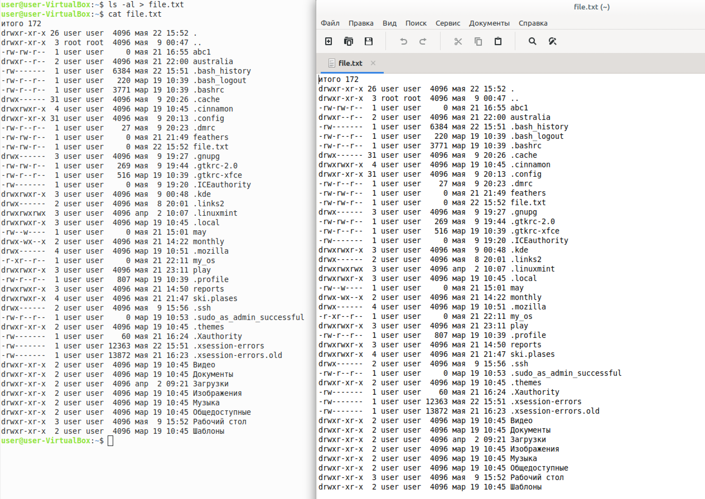

Рис 3.  1 «Запись вывода в файл»

  3. Выведите имена всех файлов из file.txt, имеющих расширение .conf, после
чего запишите их в новый текстовой файл conf.txt.

  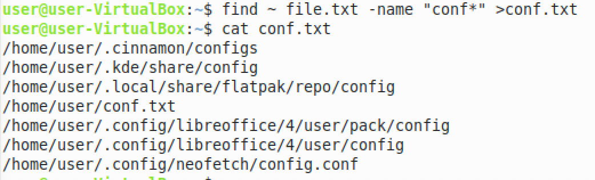

Рис 3.  2 «Вывод имен файлов»

  4. Определите, какие файлы в вашем домашнем каталоге имеют имена, начинавшиеся с символа c? Предложите несколько вариантов, как это сделать.

  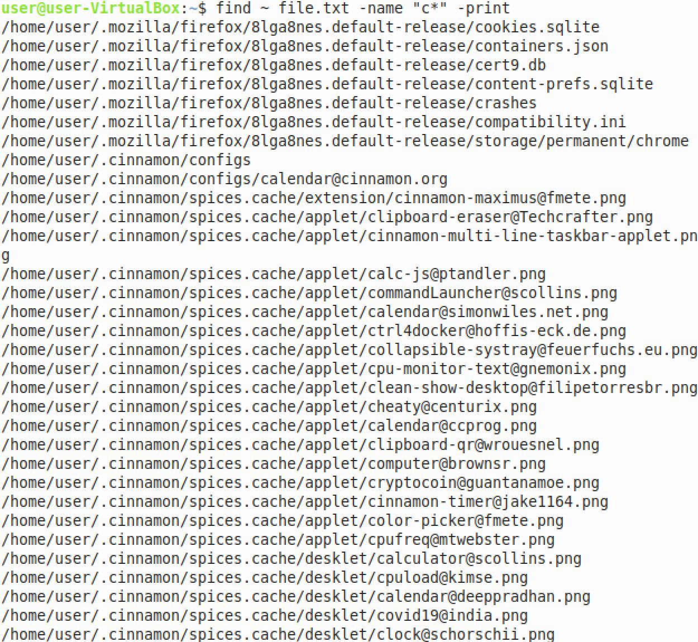

Рис 3.  3 «Варианты сортироваки вывода по буксе "с"»

  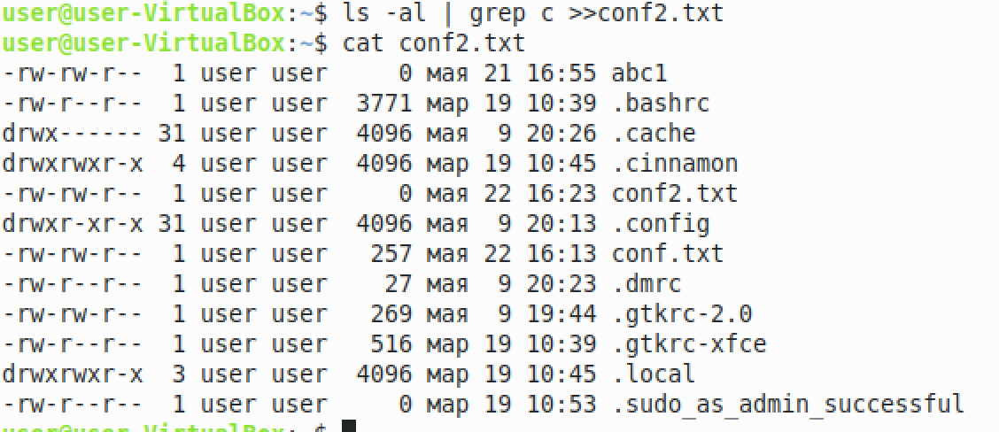

Рис 3.  4 «Варианты сортироваки вывода по буксе "с"»

  5. Выведите на экран (по странично) имена файлов из каталога /etc, начинающи-
еся с символа h.

  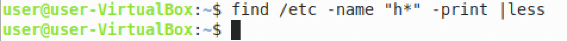

Рис 3.  5 «Вывод имен файлов из каталога»

  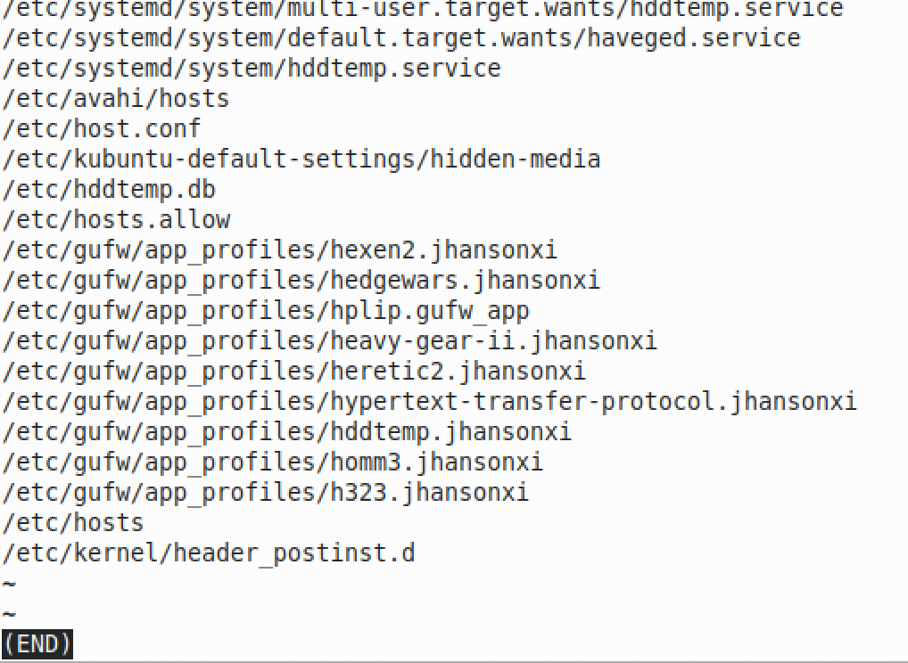

Рис 3.  6 «Вывод имен файлов из каталога»

  6. Запустите в фоновом режиме процесс, который будет записывать в файл
~/logfile файлы, имена которых начинаются с log.

  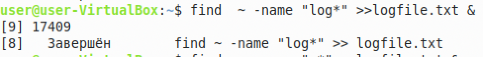

Рис 3.  7 «Процесс в фоновом режиме»

  
  7. Удалите файл ~/logfile.

  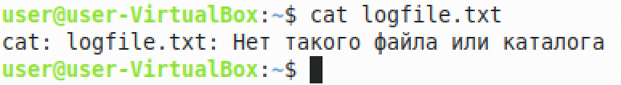

Рис 3.  8 «Удаленный каталог»

  8. Запустите из консоли в фоновом режиме редактор gedit.

  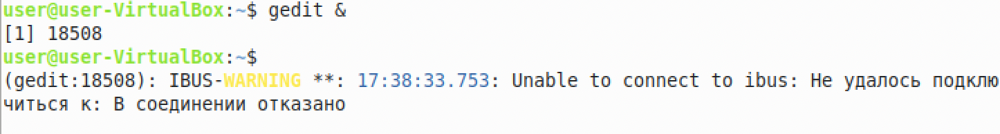

Рис 3.  9 «Запуск приложения в фоновом режиме»

  9. Определите идентификатор процесса gedit, используя команду ps, конвейер и
фильтр grep. Можно ли определить этот идентификатор более простым способом?

  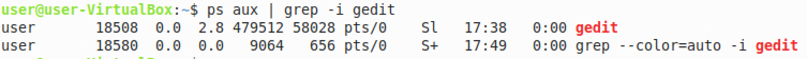

Рис 3.  10 «Определение идентификатора процесса»

  

Рис 3.  11 «Определение идентификатора более простым способом»

  10. Прочтите справку (man) команды kill, после чего используйте её для завершения процесса gedit.

  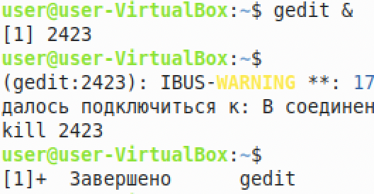

Рис 3.  12 «Определение идентификатора более простым способом»

  11. Выполните команды df и du, предварительно получив более подробную информацию об этих командах, с помощью команды man.

Команда «df» расшифровывается как «дисковая файловая система», она используется для получения полной сводной информации об использовании доступного и используемого дискового пространства файловой системы в системе.

Команда "du"  – это стандартная команда Unix/Linux, используется для показа суммарной информации об использовании диска файлами и директориями. 

  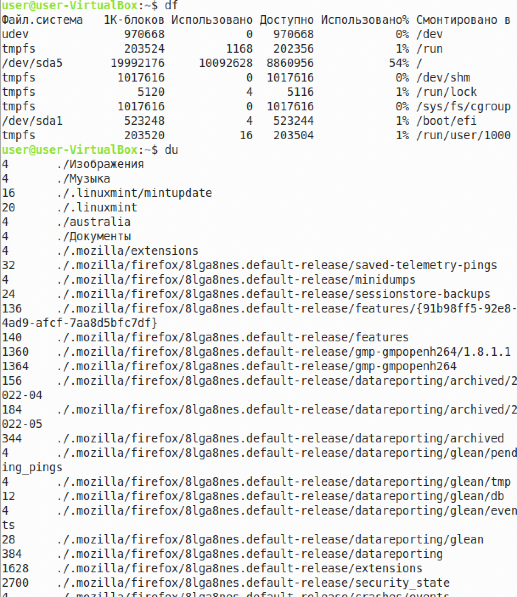

Рис 3.  13 «Команды df и du»

  12. Воспользовавшись справкой команды find, выведите имена всех директорий,
имеющихся в вашем домашнем каталоге.

  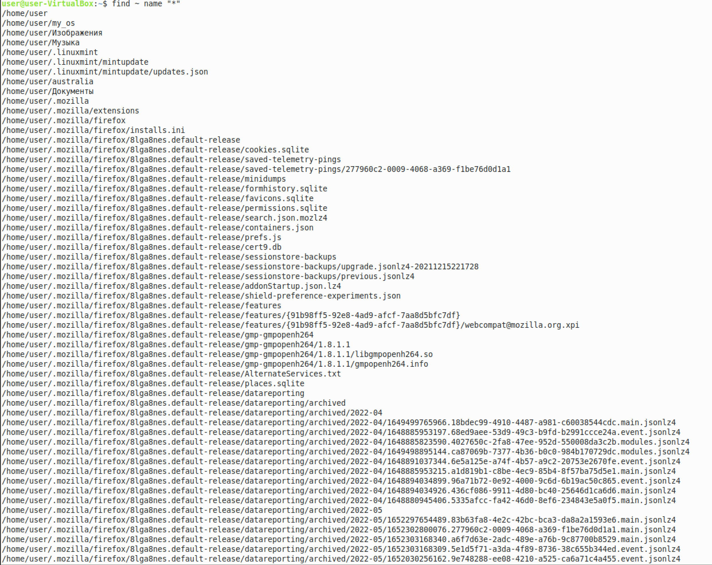

Рис 3.  14 «Команды df и du»

  

>**4) Выводы согласованные с заданием работы**

В результате выполнения этой работы озакомились с инструментами поиска файлов и фильтрации текстовых данных. Приобретение практических навыков: по управлению процессами (и заданиями), по проверке использования диска и обслуживанию файловых систем.

>**5) Ответы на контрольные вопросы**
  1. Какие потоки ввода вывода вы знаете?

В системе по умолчанию открыто три специальных потока:
– stdin — стандартный поток ввода (по умолчанию: клавиатура), файловый де-
скриптор 0;
– stdout — стандартный поток вывода (по умолчанию: консоль), файловый де-
скриптор 1;
– stderr — стандартный поток вывод сообщений об ошибках (по умолчанию:
консоль), файловый дескриптор 2.

  2. Объясните разницу между операцией > и >>.

> записывает действия в файл, если попытаться выполнить команду снова команда перезапишет данные
>> добавляет данные в файл, не перезаписывая их

  3. Что такое конвейер?

Конвейер (pipe) служит для объединения простых команд или утилит в цепочки,
в которых результат работы предыдущей команды передаётся последующей.

  4. Что такое процесс? Чем это понятие отличается от программы?

Процеесс — это идентифицируемая абстракция совокупности взаимосвязанных системных ресурсов на основе отдельного и независимого виртуального адресного пространства в контексте которой организуется выполнение потоков

  5. Что такое PID и GID?

Process IDentifier, PID) — уникальный номер (идентификатор) процесса в многозадачной операционной системе 

Идентификатор группы, часто сокращенно GID, представляет собой числовое значение, используемое для представления определенной группы

  6. Что такое задачи и какая команда позволяет ими управлять?

Термин задача используется в Linux для обозначения единицы выполнения, которая может совместно использовать различные системные ресурсы с другими задачами в системе

  7. Найдите информацию об утилитах top и htop. Каковы их функции?

 top - интерактивный просмотрщик процессов. htop аналог top.

Программа top динамически выводит в режиме реального времени информации о работающей системе, т.е. о фактической активности процессов. По умолчанию она выдает задачи, наиболее загружающие процессор сервера, и обновляет список каждые две секунды. 

  8. Назовите и дайте характеристику команде поиска файлов. Приведите примеры
использования этой команды.

Find - это команда для поиска файлов и каталогов на основе специальных условий.
Пример: find . -name "test" -not -name "*.php"

  9. Можно ли по контексту (содержанию) найти файл? Если да, то как?

Да,можно - с помощью команды grep и опций. 
Пример: grep -lir 'class List' /home/balancer/programming/java/jbforth

  10. Как определить объем свободной памяти на жёстком диске?

Это можно сделать выполнив команду df

  11. Как определить объем вашего домашнего каталога?

Это можно сделать следующей командой du -sh ~

  12. Как удалить зависший процесс?

Зависший процесс можно удалить командой kill название программы или номер процесса