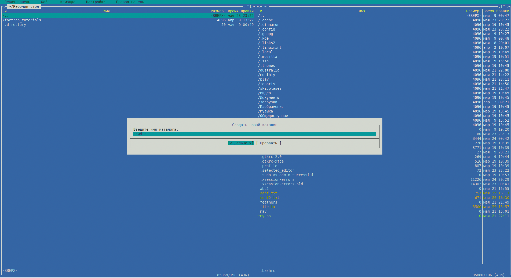

РОССИЙСКИЙ УНИВЕРСИТЕТ ДРУЖБЫ НАРОДОВ

Факультет физико-математических и естественных наук

Кафедра прикладной информатики и теории вероятностей
    

ОТЧЕТ
 

ПО ЛАБОРАТОРНОЙ РАБОТЕ №6
 

дисциплина:Операционные системы
      

Студент: Мартемьянов Александр
 

Группа: НПМбв-02-18
      

МОСКВА
 

2022 г.
 

>**2)Задание**

Освоение основных возможностей командной оболочки Midnight Commander.
Приобретение навыков практической работы по просмотру каталогов и файлов; манипуляций с ними.

>**3) Последовательность выполнения работы**

1. Изучите информацию о mc, вызвав в командной строке man mc.

  

Рис 3.  1 «Справка по Midnight
Commander»

2. Запустите из командной строки mc, изучите его структуру и меню.

  

Рис 3.  2 «Midnight
Commander»

3. Выполните несколько операций в mc, используя управляющие клавиши
(операции с панелями; выделение/отмена выделения файлов, копирование/перемещение файлов, получение информации о размере и правах доступа
на файлы и/или каталоги и т.п.)

Я выполняю работу на виртуальной машине,поэтому некоторые комбинации у меня могут отличаться в отличии от комбинаций на установленной ос

Для выделения одного или нескольких файлов использую Shift + PgUP или PgDOWN и так же снятие выделения

  

Рис 3.  3 «Выделение файла или нескольких фалйлов в mc»

Для того что бы скопировать файл или каталог в нужную директорию F5 и здесь мы видим что мы копируем и куда, а так же опции копирования, действие отменяется кнопкой esc

  

Рис 3.  4 «Копирование директории»

  

Рис 3.  5 «Копирование файла»

Для перемещения файла используем F6, видим то же самое что и при копировании - откуда, куда и опции перемещения, действие отменяется кнопкой esc

  

Рис 3.  6 «Перемещение файла»

Для того что бы отредактировать права доступа используем ( Ctrl-x c ) и видим выводимое окно в котором можем поменять атрибуты

  

Рис 3.  7 «Изменение прав доступа mc»

Для определия размера директории можно воспользоваться колонкой "размер", вес указывается для пустой директории
Если нажать комбинацию CTRL + Space можно увидеть вес директории вместе с вложенными директориями и файлами

  

Рис 3.  8 «Вес пустой директории»

  

Рис 3.  9 «Вес для директории и вложенных директорий и папок»

4. Выполните основные команды меню левой (или правой) панели. Оцените сте-
пень подробности вывода информации о файлах.

Выполню команду левой панели, информация, видно что в зависимости от выбранной папки справа - слева будет отображаться более подробная информация о директории или файле

  

Рис 3.  10 «Подробная информация о файлах»

Вывод левой панели в режиме дерево, на правой панели отоборажается содержимое выбраного каталога

  

Рис 3.  11 «Режим панели дерево»

Вывод в режиме быстрый просмотр показывает содержимое в левой панели и структуру в правой панели

  

Рис 3.  12 «Режим панели быстрый просмотр»

5. Используя возможности подменю Файл , выполните:
– просмотр содержимого текстового файла;

  

Рис 3.  13 «Просмотр текствого файла»

– редактирование содержимого текстового файла (без сохранения результатов
редактирования);

  

Рис 3.  14 «Редактирование текстового файла»

– создание каталога;

  

Рис 3.  15 «Создание каталога»

– копирование в файлов в созданный каталог.

  

Рис 3.  16 «Копирование в каталог»

6. С помощью соответствующих средств подменю Команда осуществите:
– поиск в файловой системе файла с заданными условиями (например, файла
с расширением .c или .cpp, содержащего строку main);

  

Рис 3.  17 «Поиск по условию»

– выбор и повторение одной из предыдущих команд;

  

Рис 3.  18 «История команд»

– переход в домашний каталог;

Для перехода в домашний каталог можно воспользоваться консолью и написать команду cd

  

Рис 3.  19 «Переход в домашний каталог»

– анализ файла меню и файла расширений.

  

Рис 3.  20 «Редактирование файла меню»

  

Рис 3.  21 «Редактирование файла расширений»

7. Вызовите подменю Настройки . Освойте операции, определяющие структуру
экрана mc (Full screen, Double Width, Show Hidden Files и т.д.)

В этом меню есть множество настроек

В меню "параметры конфигуряций" можно поменять дополнительные настройки mc, такие как параметры файловых операций, пауза после выполения и прочие настройки

  

Рис 3.  22 «Меню "параметры конфигуряций"»

В меню "внешний вид" можно поменять параметры отобрадения панелей, вывод консоли, и прочие настройки

  

Рис 3.  23 «Меню "внешний вид"»

В меню "настройки панели" можно поменять основные настройки панелей, дополнительные параметры навигации, цвет и параметры поиска"

  

Рис 3.  24 «меню "настройки панели"»

В меню "подтверждение" можно поменять настройки вывода предупреждения при выполнении определенных операций

  

Рис 3.  25 «Меню "подтверждение"»

В меню "оформление" можно изменить внешнее отображение mc, например включить темный режим

  

Рис 3.  26 «Меню "оформление"»

В меню "отображение символов" можно изменить параметры кодировки и режим ввода

  

Рис 3.  27 «Меню "отображение символов"»

В меню "распознавание клавиш" можно изменить назначение функциональных клавиш

  

Рис 3.  28 «Меню "распознавание клавиш"»

В меню "настройки виртуальной файловой системы" можно изменить настройки подключения к сетевому хранилищу FTP

  

Рис 3.  29 «Меню "настройки виртуальной файловой системы"»

Задание по встроенному редактору mc

1. Создайте текстовой файл text.txt.

  

Рис 3.  30 «Создание файла text.txt"»

2. Откройте этот файл с помощью встроенного в mc редактора.

  

Рис 3.  31 «Открываем файл для редактирования"»

3. Вставьте в открытый файл небольшой фрагмент текста, скопированный из лю-
бого другого файла или Интернета.

  

Рис 3.  32 «Вставляем фрагмент в редактируемый документ»

4. Проделайте с текстом следующие манипуляции, используя горячие клавиши:
4.1. Удалите строку текста.

Фрагмент удаляем с помощью сочетания ALT+F8

  

Рис 3.  33 «Удаление фрагмента текста»

4.2. Выделите фрагмент текста и скопируйте его на новую строку.

  

Рис 3.  35 «Вставляем фрагмент в редактируемый документ»

4.3. Выделите фрагмент текста и перенесите его на новую строку.

  

Рис 3.  36 «Перенос строки с фрагментом текста»

4.4. Сохраните файл.

  

Рис 3.  37 «Сохранение файла»

4.5. Отмените последнее действие.

  

Рис 3.  38 «Отмена изменений»

4.6. Перейдите в конец файла (нажав комбинацию клавиш) и напишите некоторый текст.

  

Рис 3.  39 «Запись текста в конце файла»

4.7. Перейдите в начало файла (нажав комбинацию клавиш) и напишите некоторый текст.

  

Рис 3.  40 «Запись текста в начале файла»

4.8. Сохраните и закройте файл.

  

Рис 3.  41 «Закрытый и созраненный файл text.txt»

5. Откройте файл с исходным текстом на некотором языке программирования (например C или Java)

  

Рис 3.  42 «Открытый файл с кодом .f90»

6. Используя меню редактора, включите подсветку синтаксиса, если она не вклю-
чена, или выключите, если она включена.

  

Рис 3.  43 «Включенная подстветка синтаксиса»

>**4) Выводы согласованные с заданием работы**

В результате выполнения этой работы освоили основные возможности командной оболочки Midnight Commander.
Приобрели навыки практической работы по просмотру каталогов и файлов; манипуляций с ними.

>**5) Ответы на контрольные вопросы**

1. Какие режимы работы есть в mc. Охарактеризуйте их.

Режим "Информация"
В этом режиме на панель выводится информация о подсвеченном в другой панели файле и о текущей файловой системе (тип, свободное пространство и число свободных inode)

Режим "Дерево"
В режиме отображения дерева каталогов мы увидим в одной из панелей отображение структуры в виде дерева

Режим "Быстрый просмотр" ("Quick View")
В этом режиме панель переключается на отображение содержимого файла, подсвеченного
в другой панели.

Режимы "Сетевое соединение" и "FTP-соединение"
Эти два режима используются для отображения списка каталогов, располагающихся на удаленных компьютерах. В остальном формат вывода информации аналогичен форматам, используемым для отображения локальных каталогов.

2. Какие операции с файлами можно выполнить как с помощью команд shell, так и
с помощью меню (комбинаций клавиш) mc? Приведите несколько примеров.

Например просмотр файла, через коммандную строку - cat, из mc - F3

Создание каталога - mkdir, mc - F7

3. Опишите структура меню левой (или правой) панели mc, дайте характеристику
командам.

Формат списка

Этот пункт меню предназначен для определения формата вывода списка  файлов  в  панели.  Вы
можете  выбрать один из 4 вариантов представления списка файлов: Стандартный, Укороченный,
Расширенный и Определяемый пользователем.

Информация

В этом режиме на панель выводится информация о подсвеченном в другой панели файле и
о текущей файловой системе (тип, свободное пространство и число свободных inode).

Дерево 

Режим отображения дерева каталогов подобен тому, который вы увидите,  выбрав  пункт
Дерево каталогов из меню "Команды" ("Commands"). Смотрите соответствующий раздел.

Быстрый просмотр

В  этом режиме панель переключается на отображение содержимого файла, подсвеченного
в другой панели. Для вывода используется встроенная программа просмотра файлов, так
что,  если  переключиться  клавишей Tab в панель просмотра, вы сможете использовать
все команды управления просмотром.

Порядок сортировки

тображение списка файлов в любой из панелей может производиться в соответствии с одним из
восьми порядков сортировки:
- по имени;
- по расширению;
- по размеру файла;
- по времени модификации;
- по времени последнего обращения к файлу;
- по времени последнего изменения атрибутов файла;
- по номеру узла (inode);
- без сортировки.

Фильтр
Пункт меню "Фильтр" позволяет задать шаблон, которому должны соответствовать имена файлов,
отображаемых  в  панели  (например,  *.tar.gz).   Имена  каталогов  и  ссылки  на каталоги
отображаются всегда, независимо от шаблона.

Перечитать
Команда "Перечитать" обновляет список, отображаемый на панели. Это бывает  полезно  в  тех
случаях, когда другие процессы создают или удаляют файлы.

4. Опишите структура меню Файл mc, дайте характеристику командам.

Меню File содержит команды

View -	F3, Shift-F3 	выводит содержимое текущего файла, при нажатии Shift-F3 просмотр будет выполнен без форматирования и предварительной обработки файла

Edit -	F4 	вызывает редактор "vi" или любой другой, указанный в переменной окружения EDITOR

Copy -	F5 	Проводит копирование файла с предварительным опросом пользователя. Копирование можно прервать в любой момент, нажав Ctrl-c или ESCAPE.

Rename / Move - F6 	Проводит переименование или перемещение файла с предварительным опросом пользователя. Операцию можно прервать в любой момент, нажав Ctrl-c или ESCAPE.

Mkdir -	F7 	создаёт каталог с указанным пользователем именем

Delete - F8 	удаляет текущий файл или группу файлов из активной панели. Удаление можно прервать нажав Ctrl-c или ESCAPE.

Link -	Ctrl-x l 	создает жесткую ссылки к текущему файлу

SymLink -	Ctrl-x s 	создает символической ссылку к текущему файлу

Select group -	+ 	формирует группу файлов по заданному шаблону

Unselect group -	\ 	отменяет формирование группы по заданному шаблону

Exit -	F10 	завершить работу с MC

Quick - cd 	Alt-c 	перейти в указанный пользователем каталог 

5. Опишите структура меню Команда mc, дайте характеристику командам.

Меню Command содержит команды

User menu -	F2 	вызывает меню пользователя

Directory tree 	 - 	показывает иерархическую структуру каталогов системы

Find file -	Alt-Shift-? 	позволяет находить указанные файлы

Swap panels -	Ctrl-u 	меняет местами содержимое окон

Panels on/off -	Ctrl-o 	Включает или отключает показ окон, используется для просмотра результата последней выполнявшейся программы

Compare directories -	Ctrl-x d 	сравнивает содержимое каталогов, отображаемых окнах MC

Command history -	Alt-h 	выводит список всех команд, введенных в процессе работы

Directory hotlist -	Ctrl-\ 	выполняет быструю смену текущего каталога на один из списка

Edit extension file 	- 	редактирует файл расширений, позволяя указывать программы, которые будут выполняться при попытке запуска, просмотра, редактирования и выполнения других действий над файлами с определёнными расширениями

Edit menu file 	 - 	редактирует файл пользовательского меню, которое вызывается нажатием клавиши F2.

 
6. Опишите структура меню Настройки mc, дайте характеристику командам.

Меню Options содержит команды

Пункт Configuration (Конфигурация) задает основные параметры MC.

Пункт Layout (Внешний вид) задает внешний вид экрана MC через диалоговое окно

Пункт Panel Options (Параметры панели) задает параметры панели через диалоговое окно

Пункт Confirmation (Подтверждения) дает возможность включить запросы на подтверждение выполнения операций удаления и перезаписи файлов, а также запуска программ.

Пункт Learn keys (Распознавание клавиш) вызывает диалоговое окно, в котором можно протестировать работу некоторых клавиш (F1-F20, Home, End), которые работают не на всех типах терминалов.

Пункт Virtual FS (Виртуальные ФС) вызывает диалоговое окно, в котором можно задать значения некоторых параметров, связанных с использованием виртуальных файловых систем.

Пункт Save setup (Сохранить настройки) обеспечивает сохранение выбранных значений параметров в файле ~/.mc/ini

7. Назовите и дайте характеристику встроенным командам mc.

F1 — Помощь

F2 — Сохранить изменения в файл при редактировании

F3 — Просмотр файла

F3 — (Во время редактирования) Начать выделение текста. Повторное нажатие F3 закончит выделение

F4 — Редактирование файла

F5 — Скопировать выделенное

F6 — Переместить выделенное

F8 — Удалить выделенное  

Shift+F1 — вызывается меню быстрого перехода между точками монтирования на левой панели

Shift+F2 — вызывается меню быстрого перехода между точками монтирования на правой панели

Shift+F5 — скопировать файл в этот же каталог

Shift+F6 — переместить/переименовать файл в этот же каталог

8. Назовите и дайте характеристику командам встроенного редактора mc.

F4 (в редакторе) — поиск с заменой

F6 (в редакторе) — поиск с помощью регулярного выражения

Shift-Del (в редакторе) — удалить блок (и положить его в clipboard)

Shift-Ins (в редакторе) — вставить блок из буфера (работает даже в другой консоли!!!) Можно редактировать два и более файлов на разных консолях и гонять блоки между ними.

Ctrl+f — Занести выделенный фрагмент во внутренний буфер обмена mc (записать во внешний файл)

Ctrl+k — Удалить часть строки до конца строки

Ctrl+n — Создать новый файл

Ctrl+s — Включить или выключить подсветку синтаксиса

Ctrl+t — Выбрать кодировку текста

Ctrl+u — Отменить действия

Ctrl+x — Перейти в конец следующего

Ctrl+y — Удалить строку

Ctrl+z — Перейти на начало предыдущего слова

9. Дайте характеристику средствам mc, которые позволяют создавать меню, определяемые пользователем.

Меню пользователя - это меню, вызываемое при нажатии клавиши F2 и состоящее из команд, определённых пользователем. Меню создается через главное меню MC command/edit menu file.

Возможны два варианта меню: главное и локальное. Главное меню пользователя хранится в файле ~/.config/mc/menuи действует во всех каталогах файловой системы. Локальное меню хранится в файле ~/.mc.menu и действует только в том каталоге, где находится этот файл.

Кроме пользовательских меню MC имеет собственное системное меню, которое находится в файле /etc/mc/mc.menu. Это меню работает только тогда, когда не определено главное меню пользователя и в каталоге отсутствует локальное меню. Если в каталоге есть локальное меню, то главное меню в этом каталоге не работает.

10. Дайте характеристику средствам mc, которые позволяют выполнять действия,
определяемые пользователем, над текущим файлом.

Например

Ctrl+n	Создать новый файл, пользователь самостоятельно определяет путь и имя файла
Ctrl+f	Копировать выделенный текст в файл, пользователь самостоятельно определяет какой фрагмент и куда копирует
Shift+F5	Вставка текста из файла, пользователь самостоятельно определяет файл и текст для копирования
Ctrl+s поиск файла или каталога, пользователь самостоятельно определяет параметры поиска
