
РОССИЙСКИЙ УНИВЕРСИТЕТ ДРУЖБЫ НАРОДОВ

Факультет физико-математических и естественных наук

Кафедра прикладной информатики и теории вероятностей
    

ОТЧЕТ
 

ПО ЛАБОРАТОРНОЙ РАБОТЕ №6
 

дисциплина:Операционные системы
      

Студент: Мартемьянов Александр
 

Группа: НПМбв-02-18
      

МОСКВА
 

2022 г.
 

>**2)Задание**

Познакомиться с операционной системой Linux. Получить практические навы-
ки работы с редактором vi, установленным по умолчанию практически во всех дис-
трибутивах.

>**3) Последовательность выполнения работы**

Задание 1. Создание нового файла с использованием vi

1. Создайте каталог с именем ~/work/os/lab06.

  

Рис 3.  1 «Создание каталога»

2. Перейдите во вновь созданный каталог.

  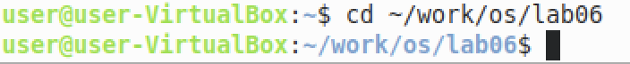

Рис 3.  2 «Перемещение в созданнный каталог»

3. Вызовите vi и создайте файл hello.sh

  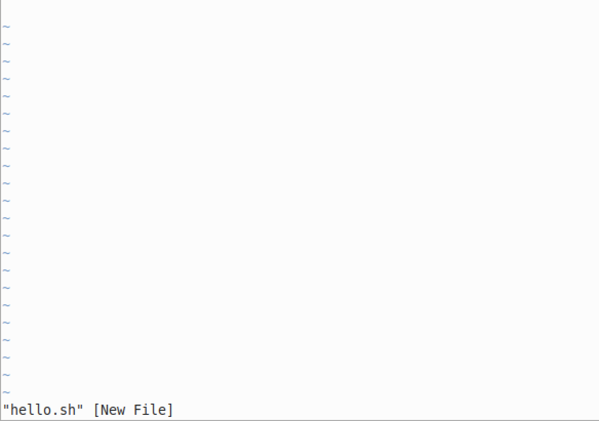

Рис 3.  3 «Создание файла hello.sh»

4. Нажмите клавишу i и вводите следующий текст.

#!/bin/bash
HELL=Hello
function hello {
LOCAL HELLO=World
echo $HELLO
}
echo $HELLO
hello

  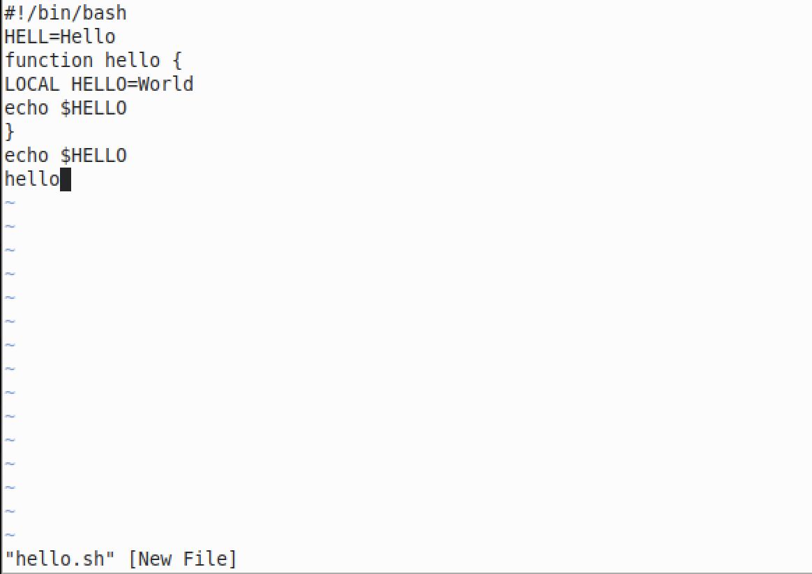

Рис 3.  4 «Введение текста»

5. Нажмите клавишу Esc для перехода в командный режим после завершения ввода
текста.
6. Нажмите : для перехода в режим последней строки и внизу вашего экрана
появится приглашение в виде двоеточия.

  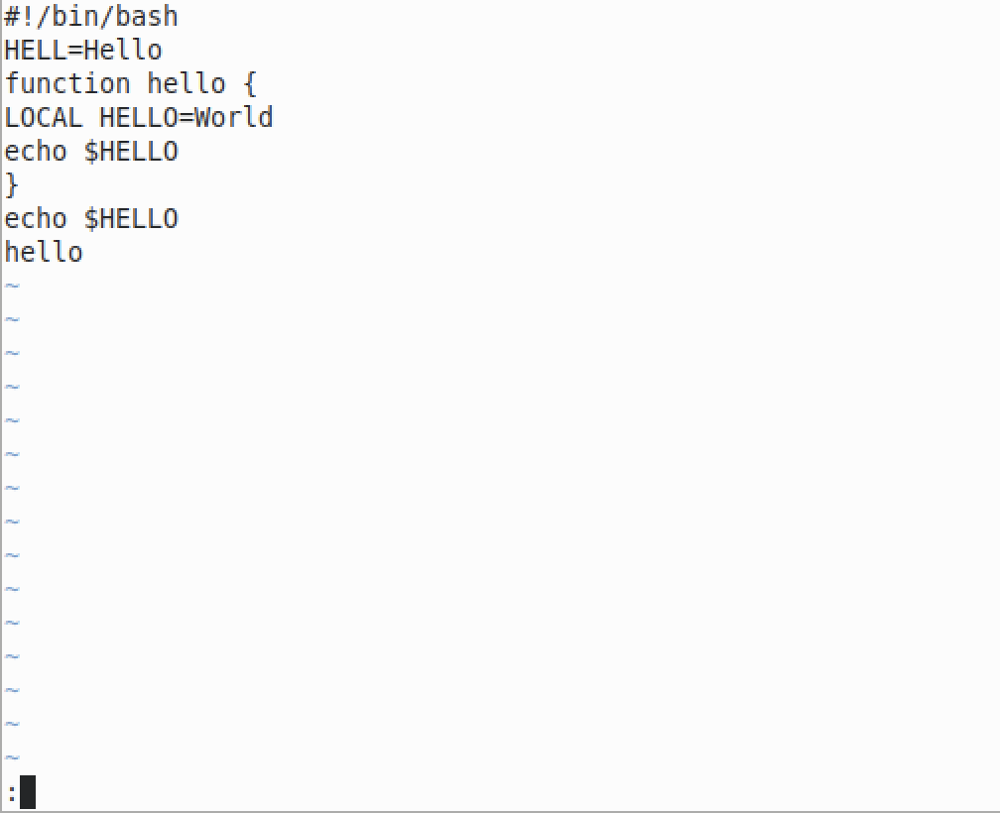

Рис 3.  5 «Переход в режим последней строки»

7. Нажмите w (записать) и q (выйти), а затем нажмите клавишу Enter для со-
хранения вашего текста и завершения работы.

  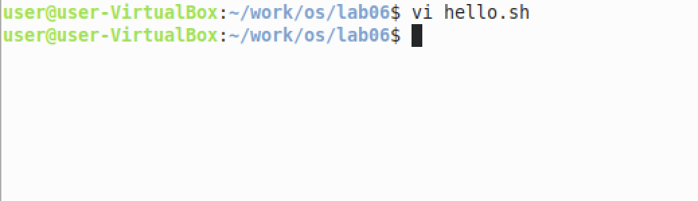

Рис 3.  6 «Результат сохранения файла»

8. Сделайте файл исполняемым
chmod +x hello.sh

  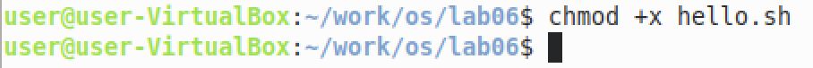

Рис 3.  7 «Добавление прав на исполнение файлу hello.sh»

Задание 2. Редактирование существующего файла

1. Вызовите vi на редактирование файла
vi ~/work/os/lab06/hello.sh

  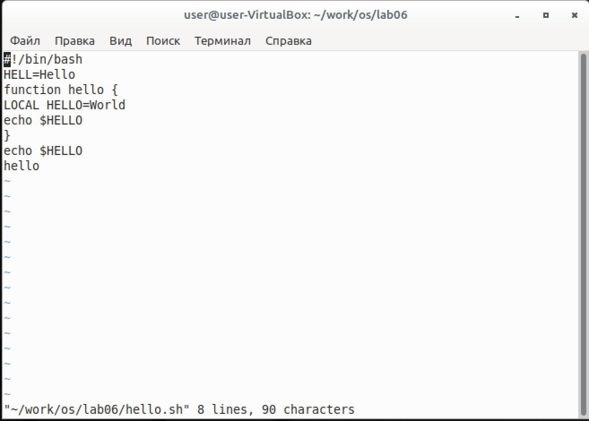

Рис 3.  8 «Вызываем на редактирование файла с помощью vi»

2. Установите курсор в конец слова HELL второй строки.

  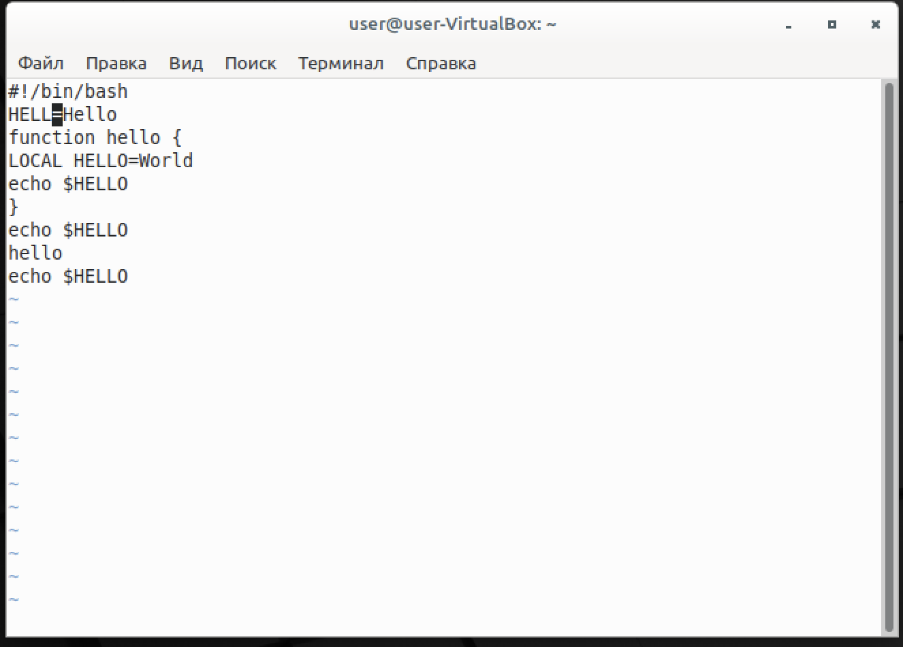

Рис 3.  9 «Устанавливаем курсор на конец слова HELL»

3. Перейдите в режим вставки и замените на HELLO. Нажмите Esc для возврата в
командный режим.

  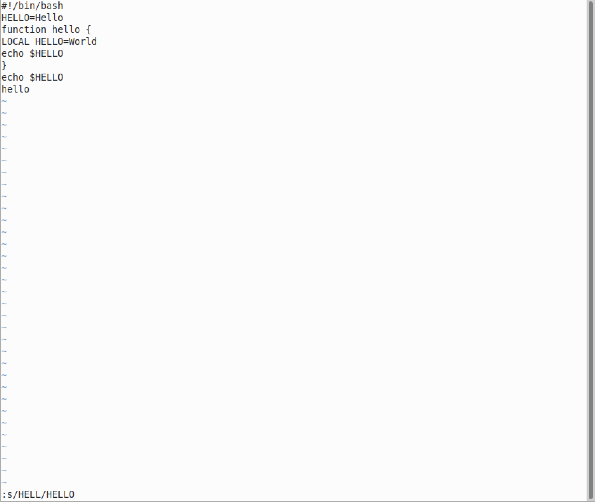

Рис 3.  10 «Замена слова HELL на HELLO»

4. Установите курсор на четвертую строку и сотрите слово LOCAL.

  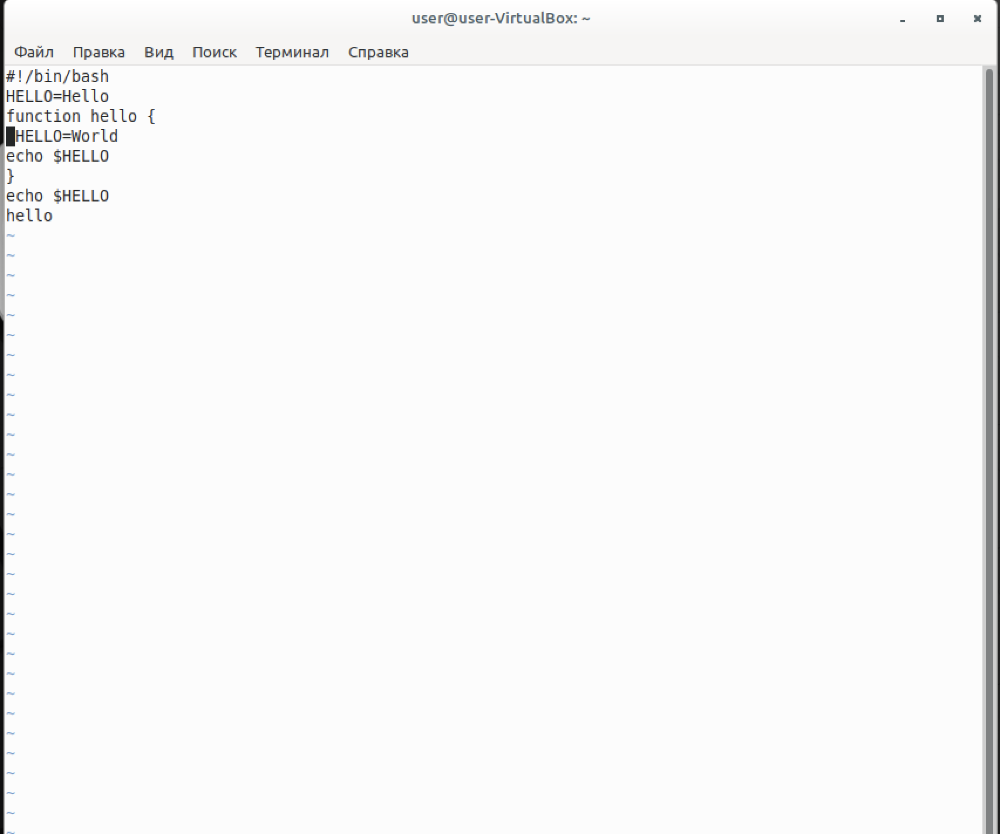

Рис 3.  11 «Стирание слова local»

5. Перейдите в режим вставки и наберите следующий текст: local, нажмите Esc
для возврата в командный режим.

  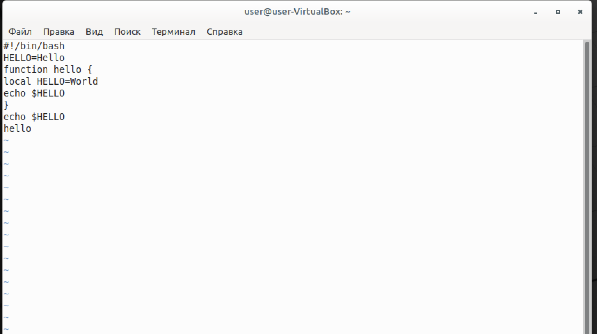

Рис 3.  12 «Режим вставки»

6. Установите курсор на последней строке файла. Вставьте после неё строку, содержащую следующий текст: echo $HELLO.

  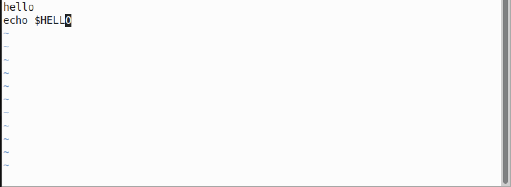

Рис 3.  13 «Вставка троки»

7. Нажмите Esc для перехода в командный режим.
8. Удалите последнюю строку.

  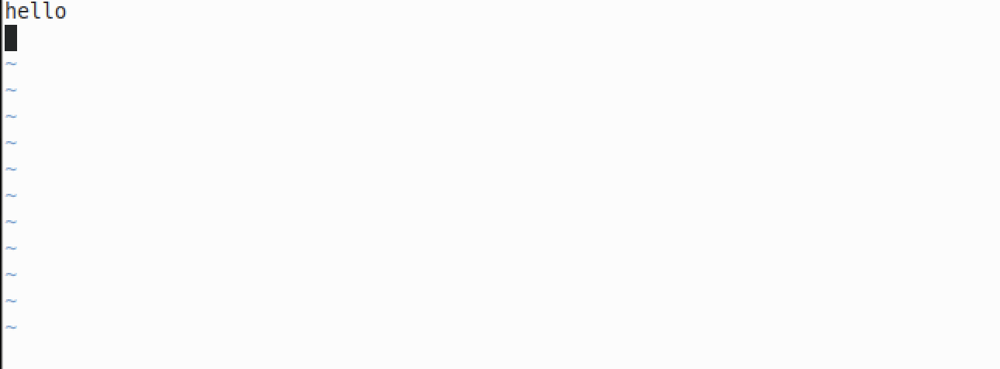

Рис 3.  14 «Удаление строки»

9. Введите команду отмены изменений u для отмены последней команды.

  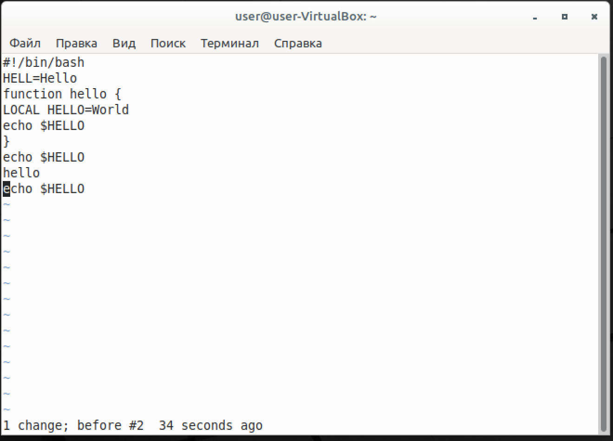

Рис 3.  16 «Отмена изменений»

10. Введите символ : для перехода в режим последней строки. Запишите произведённые изменения и выйдите из vi.

  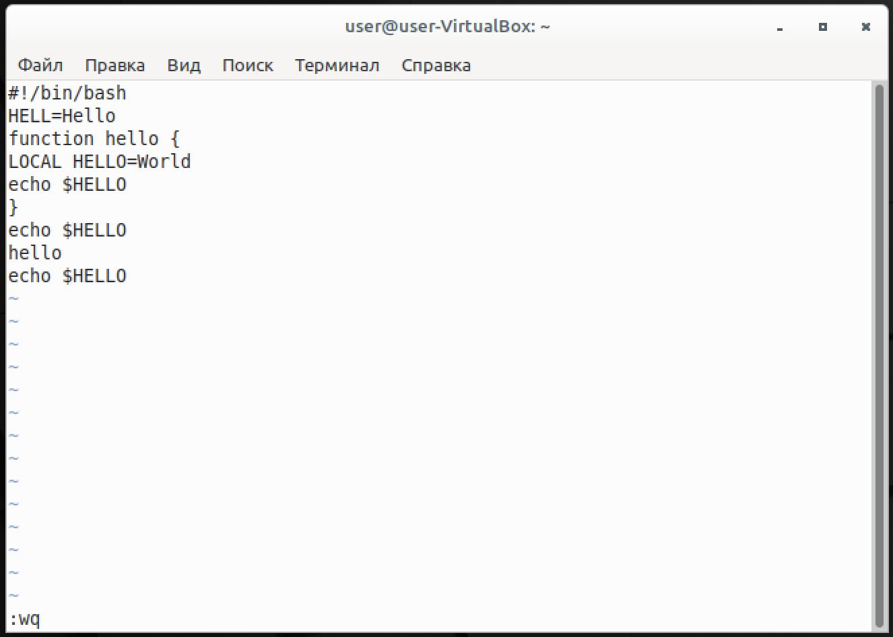

Рис 3.  16 «Сохранение и закрытие файла»

>**4) Выводы согласованные с заданием работы**

В результате выполнения этой работы освоили познакомились с операционной системой Linux. Получили практические навыки работы с редактором vi, установленным по умолчанию во многих дистрибутивах.

>**5) Ответы на контрольные вопросы**

1. Дайте краткую характеристику режимам работы редактора vi.

«Обычный режим» — перемещение по файлу, стирание текста и другие редактирующие функции. Это - основной режим, только из него можно сразу перейти в другие режимы. Для возврата в основной режим из любого другого режима ESC

«Режим ввода» - ввод текста. Как только завершается ввод текста, принято сразу возвращаться в обычный режим.

«Командный режим» - Команды (операции с файлом, поиск и замена, настройка редактора…).

2. Как выйти из редактора, не сохраняя произведённые изменения?

Перейти в обычный режим ECS, ввести :q!

3. Назовите и дайте краткую характеристику командам позиционирования.

0 Начало строки.

$ Конец строки.

h Вперед.

l Назад.

Space Тоже что и l.

fx Найти x вперед по тексту.

Fx Найти x назад по тексту.

; Повторить последнюю операцию f F.

| К специфицированной колонке.

% Найти соответствующий символ { или }. 

4. Что для редактора vi является словом?

Для редактора vi словом является набор символов

5. Каким образом из любого места редактируемого файла перейти в начало (конец)
файла?

gg - в начало

G  - в конец

6. Назовите и дайте краткую характеристику основным группам команд редакти-
рования.

i — перейти в режим ввода с текущей позиции

a — перейти в режим ввода после курсора

I — переместиться в начало строки и перейти в режим ввода

А — переместиться в конец строки и перейти в режим ввода

o — перейти в режим ввода с новой строки под курсором

O — перейти в режим ввода с новой строки над курсором

s - заменяет указанное количество символов

R — перейти в режим ввода с заменой текста

x — удалить символ под курсором (<число>x удаляет указанное число символов начиная с того который находится под курсором);

X — удалить символ влево (удалить символ перед курсором);

d — используется совместно с командами перемещения. Удаляет символы с текущего положения курсора до положения после ввода команды 
перемещения.

dw - удаляет символы с текущего до конца слова. включая пробел после слова, чтобы удалить символы до конца слова, но оставить пробел используется команда de

dE - удаляет символы с текущего до конца слова, включая символы пунктуации, но оставляет пробел после слова,

diw - удаляет слово под курсором,

dd — удалить текущую строку (вырезать);

d<число>d или <число>dd — стирание числа строк начиная с текущей;

db - удаляет символы с текущего до начала слова (удаление в обратном направлении);

d0 - удаление символов с начала строки до текущего положения курсора;

d$ или D - удаление символов с текущего положения курсора до конца строки;

7. Необходимо заполнить строку символами $. Каковы ваши действия?

Нужно ввести, например заменяя слово -- :s/HELL/$*

8. Как отменить некорректное действие, связанное с процессом редактирования?

Нужно нажать u или U, эта команда отменяет последнее действие

9. Назовите и дайте характеристику основным группам команд режима последней
строки.

wq для записи изменений в файл

q (или q!) для выхода из редактора без изменения

10. Как определить, не перемещая курсора, позицию, в которой заканчивается строка?

Нужно нажать $ это переместит курсор к концу строки

11. Выполните анализ опций редактора vi (сколько их, как узнать их назначение и
т.д.).

Для этого можно использовать команду  vimtutor или  man

12. Как определить режим работы редактора vi?

В обычном режиме» — перемещение по файлу, стирание текста и другие редактирующие функции. 

В режиме ввода - ввод текста. Как только завершается ввод текста, принято сразу возвращаться в обычный режим.

В командном режиме - операции с файлом, поиск и замена, настройка редактора

13. Постройте граф взаимосвязи режимов работы редактора vi.

  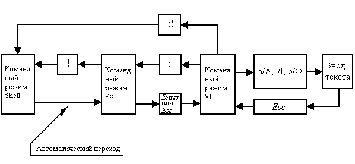

